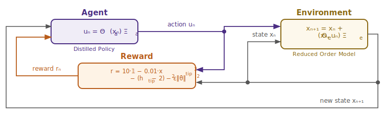
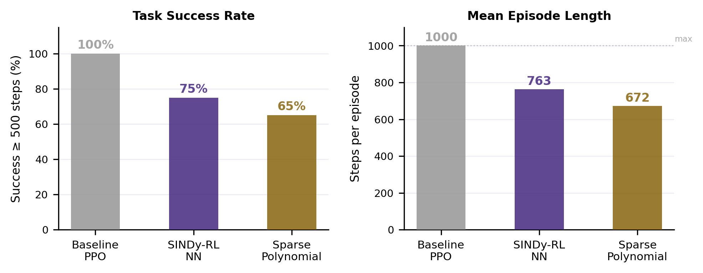

# Interpretable Control for Unstable Systems via SINDy-RL

**Patrick Smith · Andrew Falcone**  
ME 595 · Spring 2026

## 1  Introduction

Safety-critical autonomous systems increasingly require controllers that can be audited, formally verified, and deployed on embedded hardware, requirements that a nine-thousand-parameter neural network cannot satisfy [8, 9]. Consider a surgical robot adjusting a tool under tissue contact forces, or a delivery drone maintaining stability over a crowded neighborhood: in both cases a regulator may demand that the control law be inspectable before deployment, and a microcontroller with kilobytes of flash cannot execute a deep network at the required rate. A closed-form polynomial controller, by contrast, fits in kilobytes, admits analytic stability arguments, and exposes every term to inspection. Sparse Identification of Nonlinear Dynamics (SINDy [2]) produces exactly such expressions by regressing state-transition data against a polynomial library and zeroing out negligible terms. The difficulty is that unstable systems cannot generate the near-equilibrium data SINDy needs without a stabilizing controller that does not yet exist. Zolman et al. [1] resolve this chicken-and-egg problem with SINDy-RL: a Dyna-style [6] loop that co-trains an E-SINDy surrogate and a PPO policy so each iteration improves both. We implement Algorithm 1 from Zolman et al. on the inverted double pendulum (IDP), resolving several non-obvious engineering obstacles to achieve convergence, and deliver (1) a data-efficient neural network (NN) policy using 14.5× fewer real-environment steps than a full-order baseline, and (2) a degree-3 polynomial distilled from that policy.

## 2  Technical Background

### 2.1  The Testbed

\begin{wrapfigure}{r}{0.25\linewidth}
  \vspace{-48pt}
  \centering
  \includegraphics[width=\linewidth]{figures/pendulum_diagram.png}
  \captionsetup{font=scriptsize, labelfont=bf}
  \caption*{\textbf{Figure 1.} IDP geometry. State $\mathbf{x} = [x, \theta_1, \theta_2, \dot{x}, \dot{\theta}_1, \dot{\theta}_2]$. Tip height $h \in [0,\, 1.2]$ m; episode ends at $h \leq 1.0$ m.}
  \vspace{-6pt}
\end{wrapfigure}

The `InvertedDoublePendulum-v5` environment (MuJoCo/Gymnasium) has two rigid links of equal length $L_1 = L_2 = 0.6$ m on a sliding cart. The 6-dim physical state is $\mathbf{x} = [x,\theta_1,\theta_2,\dot{x},\dot{\theta}_1,\dot{\theta}_2]$; the 9-dim observation replaces raw angles with sin/cos encodings. The single action is cart force. Tip height $h = L_1\cos\theta_1 + L_2\cos(\theta_1+\theta_2)$ reaches a maximum of 1.2 m when both poles are vertical; Gymnasium terminates the episode when $h \leq 1.0$ m, leaving only a 0.2 m near-upright band between success and failure. The per-step reward is $r_k = 10\cdot\mathbf{1} - (h_k-2)^2 - 0.01\,x_\text{tip}^2 - \varepsilon\|\dot{\boldsymbol{\theta}}\|^2$, with episodes capped at 1,000 steps (50 s).

### 2.2  SINDy-C: Sparse Dynamics Identification with Control

SINDy [2] identifies discrete-time dynamics by regressing the state increment against a polynomial library:

$$\mathbf{x}_{k+1} - \mathbf{x}_k = \underbrace{\Theta(\mathbf{x}_k,\, u_k)}_{\text{library}} \cdot \underbrace{\Xi}_{\text{sparse coefficients}}$$

For control-affine systems (SINDy-C [3]), the input $u_k$ enters the library directly.[^ca] The Sequentially Thresholded Least Squares (STLSQ) algorithm zeros coefficients below threshold $\lambda$, promoting sparsity in $\Xi$. A degree-$d$ library over $n$ variables contains $\binom{n+d}{d}$ terms; for the IDP's 7-dim state-action vector, degree-2 gives 36 features and degree-3 gives 120, a distinction that proved critical (§4.3).

[^ca]: A system is control-affine if the control input appears linearly in the dynamics: $\dot{\mathbf{x}} = f(\mathbf{x}) + g(\mathbf{x})\,u$, where $f$ and $g$ may be arbitrarily nonlinear in the state. Most mechanical systems driven by forces or torques, including the IDP, satisfy this property, since force enters Newton's second law linearly.

[^fep]: The bottleneck was `PolynomialLibrary.transform()` from scikit-learn, which carries ~1 ms fixed overhead per call regardless of input size; calling it once per ensemble member cost ~10 ms/step and ~13 min per 75k-step PPO phase. The fix: at construction, extract the `powers_` exponent matrix from sklearn's `PolynomialFeatures` once; at each step, compute features as `np.prod(xu ** powers_, axis=1)` in pure NumPy and apply all 10 pre-stacked `(10, 6, 120)` coefficient matrices via a single batched matmul (~0.93 ms/step, 11.5× speedup).

### 2.3  E-SINDy: Ensemble Uncertainty Quantification

Fitting $M{=}10$ independent SINDy models on 80% bootstrap subsamples yields a free uncertainty estimate [4]: at each step, `predict(x, u)` returns $(\mu_\Delta, \sigma_\Delta)$ across ensemble members. High $\sigma_\Delta$ signals extrapolation beyond the training distribution. Following Zolman et al. §3.5 [1], we convert this into an active pessimistic penalty: surrogate reward is reduced by $\kappa\cdot\text{mean}(\sigma_\Delta)$ per step ($\kappa=5.0$), steering PPO away from high-uncertainty states.

### 2.4  Dyna-Style Model-Based Reinforcement Learning and Behavioral Cloning

The Dyna architecture [6] alternates cheap model-based rollouts with real data collection. In SINDy-RL [1], the surrogate is the E-SINDy ensemble and the planner is PPO [5]. Figure 2 shows the control loop; in SINDy-RL the Environment box is instantiated twice: as the E-SINDy surrogate during training and as real MuJoCo during data collection.

{width=82%}

A Schroeder multi-sine sweep [10] bootstraps the initial dataset $\mathcal{D}$. Each Dyna iteration refits E-SINDy on near-upright transitions, runs PPO for 100k surrogate steps (warm-started from the prior policy), then collects 4,000 real transitions. After convergence, the best checkpoint is distilled via behavioral cloning:

$$\min_{\Xi}\;\bigl\|\Theta_\text{obs}(X)\,\Xi - U^*\bigr\|_2 \quad \text{(STLSQ, } \lambda=0.05\text{)}$$

Perturbation augmentation [7] (adding Gaussian noise to expert states and re-querying the NN oracle) expands the 50k-transition dataset 5× to mitigate distribution shift without additional simulator rollouts.

## 3  Methods

### 3.1  Baseline

A standard PPO agent ([64,64] MLP tanh, 9,731 params) is trained over 15,103 episodes (400,000 real steps), serving as the performance ceiling only; it is not used as a distillation teacher.

### 3.2  SINDy-RL Pipeline

The pipeline in `notebooks/sindy-rl.ipynb` runs five stages: (1) Schroeder bootstrap: 300 episodes collecting 2,897 transitions; (2) E-SINDy fit: filter to near-upright states ($h > 1.10$ m), fit 10 degree-3 SINDy-C models on 80% subsamples, stack into a `FastEnsemblePredictor`[^fep]; (3) surrogate PPO: 100k steps inside `EnsembleSurrogateEnv` (Gymnasium wrapper over E-SINDy: replicates MuJoCo's reward and $h\leq1.0$ m termination, adds uncertainty penalty $\kappa\cdot\text{mean}(\sigma_\Delta)$, and enforces physical state bounds $|x|\leq2.5$ m, $|\theta|\leq0.9$ rad, $|\dot{\theta}|\leq12$ rad/s), early-stopped if mean episode length stays below 5 after 50k steps; (4) real data collection: 4,000 MuJoCo steps appended to $\mathcal{D}$; (5) repeat with warm-start, rolling back to best checkpoint if exploitation is detected.

Once the loop converges, the best checkpoint is optionally distilled into a sparse polynomial: 50k expert transitions collected from real MuJoCo, augmented 5× with Gaussian state perturbations, and fit with a degree-3 STLSQ polynomial on the 8-dim observation.

### 3.3  Metrics

We evaluate on real-environment step count (data efficiency), success rate (episodes lasting at least 500 steps), mean episode length, SINDy RMSE (surrogate quality), and distillation $R^2$ and term count (compactness).

## 4  Preliminary Results

### 4.1  Baseline

Full-order PPO achieves mean reward $9{,}324 \pm 2$, 100% success, and mean episode length 1,000/1,000 steps at a cost of 400,000 real simulator interactions and a 9,731-parameter opaque network. This is the performance ceiling.

### 4.2  Dyna Loop Convergence

The Dyna loop converged in four iterations using 27,512 real steps, **14.5× fewer than the baseline**. Figure 3 shows episode length and surrogate RMSE across iterations; the RMSE rise at iterations 3–4 reflects the improving policy visiting states further from vertical, yet the surrogate remained accurate enough in the near-upright band to train a transferable policy. A post-loop evaluation of the iteration-4 checkpoint gave **75% success and mean episode length 763 steps**. The converged E-SINDy dynamics model is dense: 690 out of 720 possible coefficients (120 features × 6 state dimensions) are nonzero, indicating that the IDP requires the full expressiveness of a degree-3 polynomial.

{width=82%}

### 4.3  What Didn't Work: Obstacles

Three obstacles prevented convergence on early attempts. First, a **degree-2 RMSE ceiling**: over 25 iterations the RMSE oscillated at 0.10–0.16 regardless of data volume (5k→90k transitions), because a 36-feature degree-2 library cannot express the inter-mode coupling that dominates IDP dynamics. Fix: `SINDY_DEGREE=3` (120 features), which dropped RMSE to 0.013 within two iterations. Second, a **near-upright filter geometry bug**: the filter threshold was set to 1.6 m by inheriting a reward-shaping constant (`TIP_HEIGHT_TARGET=2.0`) that has no relation to the pendulum's physical reach of $L_1+L_2=1.2$ m, silently making the filter a no-op every iteration. Fix: `SINDY_H_MIN=1.10` m, derived from segment geometry. Third, **surrogate exploitation**: in a diagnostic run, surrogate reward jumped 9× while real episode length collapsed 87%, as the policy found action sequences the polynomial predicted as highly rewarding but which were physically invalid. Neither uncertainty penalization nor rollback alone is sufficient: shared polynomial basis means all ensemble members extrapolate identically, so disagreement-based penalties are blind to the exploit; rollback limits damage but cannot prevent it. Fix: both mechanisms together.

### 4.4  Policy Distillation

Behavioral cloning from the best Dyna checkpoint produced a 165-term degree-3 polynomial achieving **65% success and mean episode length 672** (Figure 4). Three implementation issues required resolution: the distillation teacher must be the best-checkpoint policy, not the final loop policy (which may have drifted during surrogate training); degree-2 gave $R^2\approx0.905$ regardless of data, requiring degree-3 to reach $R^2=0.9916$; and perturbation augmentation was needed to close the distribution-shift gap between the NN's natural trajectory distribution and deployment states.

{width=82%}

STLSQ retained all 165/165 policy terms, so the polynomial is compact but not sparse. The distilled policy is still 59× smaller than the 9,731-param NN and exposes recognizable dominant terms: bias, proportional angle feedback, velocity damping, and inter-pole coupling. The remaining small cubic cross-terms appear to encode NN residuals rather than clean physical structure. The clearest result is data efficiency: 27,512 Dyna steps (14.5×) for the NN and 77,512 total steps (5.2×) for the distilled controller, with distillation reducing success from 75% to 65% in exchange for a closed-form policy.

### 4.5  Code Repository

All code and results: **https://github.com/falconeaj1/ME_595**. Key notebooks: `full-order-simulation.ipynb` (baseline PPO) and `sindy-rl.ipynb` (SINDy-RL pipeline). Professor Michelle Hickner added as collaborator (GitHub: mhickner).

### 5  Summary and Next Steps

Compared with baseline PPO's 400,000 real-environment steps and 9,731-parameter neural network, the SINDy-RL loop trained a PPO policy in the SINDy surrogate using 27,512 real Dyna steps, a 14.5× reduction in real-environment interactions. That policy was then distilled into a third-degree polynomial controller with 165 terms, making the final controller 59× smaller than the baseline neural network. The main result therefore demonstrates that the SINDy-RL algorithm advanced by Zolman et al. results in a substantially more data-efficient training process and a much more compact controller capable of successfully controlling highly nonlinear environments such as the inverted double pendulum, making it an attractive choice for safety-critical applications such as surgical robotics or automation in the vicinity of humans.

Future work should first continue the Dyna loop and measure how many real interactions are needed for the PPO neural policy trained in the SINDy surrogate to match the baseline's 100% success rate. Additional tests should sweep the STLSQ sparsity threshold, PPO settings, and uncertainty-penalty weight to identify whether performance is limited by the surrogate model, policy optimizer, or reward design. We should also diagnose ill-conditioning in the polynomial library and explore more physically informed SINDy libraries, since a simple trig-feature branch did not solve transfer by itself. Given that "there is no temporal dependence"[^notd] of the policy on the state as the justification for state perturbation while distilling the policy, it is unclear why the Zolman algorithm requires data collection on the real environment for distillation, which should be investigated. Longer-term extensions include a double-pendulum swing-up task for far-from-equilibrium reward shaping and autoencoder-based latent SINDy models, which may improve flexibility but would reduce direct physical interpretability.

[^notd]: Zolman et al. §2 "Approximating Policies": "Because there is no temporal dependence on $\pi_\phi$, we can assemble our data and label pairs $(\mathbf{x}, \mathbb{E}[\pi_\phi(\mathbf{x})])$ by evaluating $\pi_\phi$ for any $\mathbf{x}$." They use this to justify drawing perturbed states from a neighborhood of surrogate trajectories (inspired by tube MPC) and querying the neural policy at each perturbed state, building the distillation dataset without additional real-environment rollouts.

\medskip
\noindent\rule{\linewidth}{0.4pt}
\noindent\textbf{CRediT Statement} (\url{https://credit.niso.org})

\begingroup
\small
\begin{tabular}{lll}
\textbf{Role} & \textbf{Patrick Smith} & \textbf{Andrew Falcone} \\
\hline
Conceptualization          & Yes  & Yes        \\
Data curation              & Yes  & Yes        \\
Formal analysis            & Lead & Supporting \\
Investigation              & Yes  & Yes        \\
Methodology                & Lead & Supporting \\
Software                   & Lead & Supporting \\
Validation                 & Yes  & Yes        \\
Visualization              & Yes  & Yes        \\
Writing -- original draft  & Yes  & Yes        \\
Writing -- review \& editing & Yes & Yes       \\
\end{tabular}
\endgroup

\smallskip
\noindent\small\textit{AI tool disclosure: Claude (Anthropic) assisted with code drafting, debugging, writing iteration, and figure generation. All analysis, results, and conclusions were reviewed and executed by the authors, who take full responsibility for the submitted work.}

\newpage

# References

[1] Zolman, N., Fasel, U., Kutz, J. N., & Brunton, S. L. (2024). SINDy-RL: Interpretable and efficient model-based reinforcement learning. *arXiv:2403.09110*.

[2] Brunton, S. L., Proctor, J. L., & Kutz, J. N. (2016). Discovering governing equations from data by sparse identification of nonlinear dynamical systems. *Proceedings of the National Academy of Sciences*, 113(15), 3932–3937.

[3] Kaiser, E., Kutz, J. N., & Brunton, S. L. (2018). Sparse identification of nonlinear dynamics for model predictive control in the low-data limit. *Proceedings of the Royal Society A*, 474(2219), 20180335.

[4] Fasel, U., Kutz, J. N., Brunton, B. W., & Brunton, S. L. (2022). Ensemble-SINDy: Robust sparse model discovery in the low-data, high-noise limit, with active learning and control. *Proceedings of the Royal Society A*, 478(2260), 20210904.

[5] Schulman, J., Wolski, F., Dhariwal, P., Radford, A., & Klimov, O. (2017). Proximal policy optimization algorithms. *arXiv:1707.06347*.

[6] Sutton, R. S. (1990). Integrated architectures for learning, planning, and reacting based on approximating dynamic programming. *Proceedings of the Seventh International Conference on Machine Learning*, 216–224.

[7] Ross, S., Gordon, G., & Bagnell, D. (2011). A reduction of imitation learning and structured prediction to no-regret online learning. *Proceedings of the 14th International Conference on Artificial Intelligence and Statistics (AISTATS)*, 627–635.

[8] Arrieta, A. B., Díaz-Rodríguez, N., Del Ser, J., et al. (2020). Explainable artificial intelligence (XAI): Concepts, taxonomies, opportunities and challenges toward responsible AI. *Information Fusion*, 58, 82–115.

[9] Rudin, C. (2019). Stop explaining black box machine learning models for high stakes decisions and use interpretable models instead. *Nature Machine Intelligence*, 1(5), 206–215.

[10] Schroeder, M. R. (1970). Synthesis of low-peak-factor signals and binary sequences with low autocorrelation. *IEEE Transactions on Information Theory*, 16(1), 85–89.
