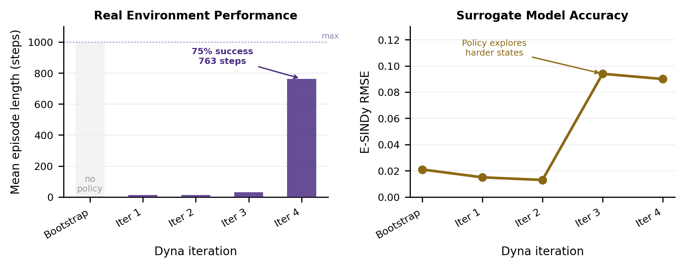

# Interpretable Control for Unstable Systems via SINDy-RL

**Patrick Smith · Andrew Falcone**  
ME 595 · Spring 2026

## 1  Introduction

Safety-critical autonomous systems increasingly require controllers that can be audited, formally verified, and deployed on embedded hardware — requirements that a nine-thousand-parameter neural network cannot satisfy [8, 9]. A closed-form polynomial controller, by contrast, fits in kilobytes, admits analytic stability arguments, and exposes every term to inspection. Sparse Identification of Nonlinear Dynamics (SINDy [2]) produces exactly such expressions by regressing state-transition data against a polynomial library and zeroing out negligible terms. The difficulty is that unstable systems cannot generate the near-equilibrium data SINDy needs without a stabilizing controller that does not yet exist. Zolman et al. [1] resolve this chicken-and-egg problem with SINDy-RL: a Dyna-style [6] loop that co-trains an E-SINDy surrogate and a PPO policy so each iteration improves both. We implement Algorithm 1 from Zolman et al. on the inverted double pendulum (IDP), resolving several non-obvious engineering obstacles to achieve convergence, and deliver (1) a data-efficient NN policy using 14.5× fewer real-environment steps than a full-order baseline, and (2) a degree-3 polynomial distilled from that policy.

## 2  Technical Background

### 2.1  The Testbed

\begin{wrapfigure}{r}{0.25\linewidth}
  \vspace{-48pt}
  \centering
  \includegraphics[width=\linewidth]{figures/pendulum_diagram.png}
  \captionsetup{font=scriptsize, labelfont=bf}
  \caption*{\textbf{Figure 1.} IDP geometry. State $\mathbf{x} = [x, \theta_1, \theta_2, \dot{x}, \dot{\theta}_1, \dot{\theta}_2]$. Tip height $h \in [0,\, 1.2]$ m; episode ends at $h \leq 1.0$ m.}
  \vspace{-6pt}
\end{wrapfigure}

The `InvertedDoublePendulum-v5` environment (MuJoCo/Gymnasium) has two rigid links of equal length $L_1 = L_2 = 0.6$ m on a sliding cart. The 6-dim physical state is $\mathbf{x} = [x,\theta_1,\theta_2,\dot{x},\dot{\theta}_1,\dot{\theta}_2]$; the 9-dim observation replaces raw angles with sin/cos encodings. The single action is cart force. Tip height $h = L_1\cos\theta_1 + L_2\cos(\theta_1+\theta_2)$ falls at 1.0 m, leaving a 0.2 m near-upright band. The per-step reward is $r_k = 10\cdot\mathbf{1} - (h_k-2)^2 - 0.01\,x_\text{tip}^2 - \varepsilon\|\dot{\boldsymbol{\theta}}\|^2$, with episodes capped at 1,000 steps (50 s).

### 2.2  SINDy-C: Sparse Dynamics Identification with Control

SINDy [2] identifies discrete-time dynamics by regressing the state increment against a polynomial library:

$$\mathbf{x}_{k+1} - \mathbf{x}_k = \underbrace{\Theta(\mathbf{x}_k,\, u_k)}_{\text{library}} \cdot \underbrace{\Xi}_{\text{sparse coefficients}}$$

For control-affine systems (SINDy-C [3]), the input $u_k$ enters the library directly. The Sequentially Thresholded Least Squares (STLSQ) algorithm zeros coefficients below threshold $\lambda$, promoting sparsity in $\Xi$. A degree-$d$ library over $n$ variables contains $\binom{n+d}{d}$ terms; for the IDP's 7-dim state-action vector, degree-2 gives 36 features and degree-3 gives 120 — a distinction that proved critical (§4.3).

### 2.3  E-SINDy: Ensemble Uncertainty Quantification

Fitting $M{=}10$ independent SINDy models on 80% bootstrap subsamples yields a free uncertainty estimate [4]: at each step, `predict(x, u)` returns $(\mu_\Delta, \sigma_\Delta)$ across ensemble members. High $\sigma_\Delta$ signals extrapolation beyond the training distribution. Following Zolman et al. §3.5 [1], we convert this into an active pessimistic penalty: surrogate reward is reduced by $\kappa\cdot\text{mean}(\sigma_\Delta)$ per step ($\kappa=5.0$), steering PPO away from high-uncertainty states.

### 2.4  Dyna-Style MBRL and Behavioral Cloning

The Dyna architecture [6] alternates cheap model-based rollouts with real data collection. In SINDy-RL [1], the surrogate is the E-SINDy ensemble and the planner is PPO [5]. Figure 2 shows the control loop; in SINDy-RL the Environment box is instantiated twice — as the E-SINDy surrogate during training and as real MuJoCo during data collection.

A Schroeder multi-sine sweep [10] bootstraps the initial dataset $\mathcal{D}$. Each Dyna iteration refits E-SINDy on near-upright transitions, runs PPO for 100k surrogate steps (warm-started from the prior policy), then collects 4,000 real transitions. After convergence, the best checkpoint is distilled via behavioral cloning:

$$\min_{\Xi}\;\bigl\|\Theta_\text{obs}(X)\,\Xi - U^*\bigr\|_2 \quad \text{(STLSQ, } \lambda=0.05\text{)}$$

Perturbation augmentation [7] — adding Gaussian noise to expert states and re-querying the NN oracle — expands the 50k-transition dataset 5× to mitigate distribution shift without additional simulator rollouts.

## 3  Methods

### 3.1  Baseline

A standard PPO agent ([64,64] MLP tanh, 9,731 params, 8 parallel envs) is trained for 400,000 real steps, serving as the performance ceiling only — it is not used as a distillation teacher.

### 3.2  SINDy-RL Pipeline

The pipeline in `notebooks/sindy-rl.ipynb` runs five stages: (1) Schroeder bootstrap — 300 episodes collecting 2,897 transitions; (2) E-SINDy fit — filter to near-upright states ($h > 1.10$ m), fit 10 degree-3 SINDy-C models on 80% subsamples, stack into a `FastEnsemblePredictor`; (3) surrogate PPO — 100k steps inside `EnsembleSurrogateEnv` with uncertainty penalty, early-stopped if mean episode length stays below 5 after 50k steps; (4) real data collection — 4,000 MuJoCo steps appended to $\mathcal{D}$; (5) repeat with warm-start, rolling back to best checkpoint if exploitation is detected. Distillation follows the loop: 50k expert transitions augmented 5× and fit with a degree-3 STLSQ polynomial on the 8-dim observation.

### 3.3  Metrics

We evaluate on real-environment step count (data efficiency), success rate ($\geq$500 steps), mean episode length, SINDy RMSE (surrogate quality), and distillation $R^2$ and term count (compactness).

## 4  Preliminary Results

### 4.1  Baseline

Full-order PPO achieves mean reward $9{,}324 \pm 2$, 100% success, and mean episode length 1,000/1,000 steps at a cost of 400,000 real simulator interactions and a 9,731-parameter opaque network. This is the performance ceiling.

### 4.2  Dyna Loop Convergence

The Dyna loop converged in four iterations using 27,512 real steps — **14.5× fewer than the baseline**. Figure 3 shows episode length and surrogate RMSE across iterations; the RMSE rise at iterations 3–4 reflects the improving policy visiting states further from vertical, yet the surrogate remained accurate enough in the near-upright band to train a transferable policy. A post-loop evaluation of the iteration-4 checkpoint gave **75% success and mean episode length 763 steps**.

| Iter | Cumul. steps | RMSE | Surr. len | Real len | Success |
|------|-------------|------|-----------|----------|---------|
| Bootstrap | 2,897 | 0.021 | — | — | — |
| 1 | 7,023 | 0.015 | 12.6 | $\approx$12 | 0% |
| 2 | 11,150 | 0.013 | 12.7 | $\approx$12 | 0% |
| 3 | 15,461 | 0.094 | 31.1 | $\approx$31 | 0% |
| 4 | 27,512 | 0.090 | **805** | **805** | **80%** |

### 4.3  What Didn't Work: Three Obstacles

Three obstacles prevented convergence on early attempts. First, a **degree-2 RMSE ceiling**: over 25 iterations the RMSE oscillated at 0.10–0.16 regardless of data volume (5k→90k transitions), because a 36-feature degree-2 library cannot express the inter-mode coupling that dominates IDP dynamics. Fix: `SINDY_DEGREE=3` (120 features), which dropped RMSE to 0.013 within two iterations. Second, a **near-upright filter geometry bug**: the filter threshold was set to 1.6 m by inheriting a reward-shaping constant (`TIP_HEIGHT_TARGET=2.0`) that has no relation to the pendulum's physical reach of $L_1+L_2=1.2$ m, silently making the filter a no-op every iteration. Fix: `SINDY_H_MIN=1.10` m, derived from segment geometry. Third, **surrogate exploitation**: in a diagnostic run, surrogate reward jumped 9× while real episode length collapsed 87%, as the policy found action sequences the polynomial predicted as highly rewarding but which were physically invalid. Neither uncertainty penalization nor rollback alone is sufficient — shared polynomial basis means all ensemble members extrapolate identically, so disagreement-based penalties are blind to the exploit; rollback limits damage but cannot prevent it. Fix: both mechanisms together.

### 4.4  Policy Distillation

Behavioral cloning from the best Dyna checkpoint produced a 165-term degree-3 polynomial achieving **65% success and mean episode length 672** (Figure 4). Three implementation issues required resolution: the distillation teacher must be the best-checkpoint policy, not the final loop policy (which may have drifted during surrogate training); degree-2 gave $R^2\approx0.905$ regardless of data, requiring degree-3 to reach $R^2=0.9916$; and perturbation augmentation was needed to close the distribution-shift gap between the NN's natural trajectory distribution and deployment states.

STLSQ retained all 165/165 policy terms — no sparsity was achieved. The IDP requires the full expressiveness of a degree-3 polynomial: the dynamics surrogate is similarly dense (690/720 nonzero coefficients). The polynomial is nonetheless 59× more compact than the 9,731-param NN and is a printable closed-form expression. Inspecting dominant terms reveals recognizable control structure — a bias ($-0.626$), proportional angle feedback ($\cos\theta_1$: $+25.5$, $\cos\theta_2$: $-3.8$), velocity damping ($\dot{x}$: $+4.4$, $\dot{\theta}_1$: $+3.5$), and inter-pole coupling ($\cos\theta_1\times\cos\theta_2$: $-158.2$) — but the remaining approximately 120 small cubic cross-terms encode NN residuals rather than physical structure. The data efficiency gain is the clearest result: 27,512 Dyna steps (14.5×) for the NN, 77,512 total steps (5.2×) for the full pipeline including distillation. The distillation step costs 50k additional real interactions and reduces success from 75% to 65%; it is only justified by a hard downstream requirement for a closed-form controller.

### 4.5  Code Repository

All code and results: **https://github.com/falconeaj1/ME_595**  
Key notebooks: `notebooks/full-order-simulation.ipynb` (baseline) · `notebooks/sindy-rl.ipynb` (SINDy-RL pipeline). Professor Michelle Hickner added as collaborator (GitHub: mhickner).

## 5  Summary and Next Steps

| Approach | Real-env steps | Mean ep len | Success | Inspectable | Parameters |
|----------|---------------|-------------|---------|-------------|------------|
| Baseline PPO | 400,000 | 1,000 | 100% | No | 9,731 |
| SINDy-RL NN (best Dyna) | 27,512 | 763 | 75% | No | 9,731 |
| SINDy-RL Poly (degree-3) | 77,512† | 672 | 65% | Partial‡ | 165 terms |

†27,512 Dyna steps + 50,000 MuJoCo distillation rollouts.  
‡Dominant terms physically recognizable; approximately 120 small cubic cross-terms are not. 59× more compact than baseline NN.

Both deliverables demonstrate data-efficient interpretable control. The open questions are: whether a tighter STLSQ threshold trades sparsity for robustness gracefully, and whether training directly in a structure-constrained surrogate can produce a sparse policy without a separate distillation step.

\noindent\rule{\linewidth}{0.4pt}

## CRediT Statement

\begingroup
\small
\begin{tabular}{lll}
\textbf{Contribution} & \textbf{Patrick Smith} & \textbf{Andrew Falcone} \\
\hline
Conceptualization & Yes & Yes \\
Methodology — SINDy-RL Dyna loop & Lead & Supporting \\
Methodology — sparse policy distillation & Lead & Supporting \\
Software — \texttt{sindy-rl.ipynb} & Lead & — \\
Software — \texttt{full-order-simulation.ipynb} & Lead & — \\
Formal analysis (obstacle diagnosis) & Lead & Supporting \\
Investigation & Yes & Yes \\
Writing — original draft \& review & Yes & Yes \\
Visualization & Yes & Yes \\
\end{tabular}
\endgroup

\newpage

# References

[1] Zolman, N., Fasel, U., Kutz, J. N., & Brunton, S. L. (2024). SINDy-RL: Interpretable and efficient model-based reinforcement learning. *arXiv:2403.09110*.

[2] Brunton, S. L., Proctor, J. L., & Kutz, J. N. (2016). Discovering governing equations from data by sparse identification of nonlinear dynamical systems. *Proceedings of the National Academy of Sciences*, 113(15), 3932–3937.

[3] Kaiser, E., Kutz, J. N., & Brunton, S. L. (2018). Sparse identification of nonlinear dynamics for model predictive control in the low-data limit. *Proceedings of the Royal Society A*, 474(2219), 20180335.

[4] Fasel, U., Kutz, J. N., Brunton, B. W., & Brunton, S. L. (2022). Ensemble-SINDy: Robust sparse model discovery in the low-data, high-noise limit, with active learning and control. *Proceedings of the Royal Society A*, 478(2260), 20210904.

[5] Schulman, J., Wolski, F., Dhariwal, P., Radford, A., & Klimov, O. (2017). Proximal policy optimization algorithms. *arXiv:1707.06347*.

[6] Sutton, R. S. (1990). Integrated architectures for learning, planning, and reacting based on approximating dynamic programming. *Proceedings of the Seventh International Conference on Machine Learning*, 216–224.

[7] Ross, S., Gordon, G., & Bagnell, D. (2011). A reduction of imitation learning and structured prediction to no-regret online learning. *Proceedings of the 14th International Conference on Artificial Intelligence and Statistics (AISTATS)*, 627–635.

[8] Arrieta, A. B., Díaz-Rodríguez, N., Del Ser, J., et al. (2020). Explainable artificial intelligence (XAI): Concepts, taxonomies, opportunities and challenges toward responsible AI. *Information Fusion*, 58, 82–115.

[9] Rudin, C. (2019). Stop explaining black box machine learning models for high stakes decisions and use interpretable models instead. *Nature Machine Intelligence*, 1(5), 206–215.

[10] Schroeder, M. R. (1970). Synthesis of low-peak-factor signals and binary sequences with low autocorrelation. *IEEE Transactions on Information Theory*, 16(1), 85–89.
