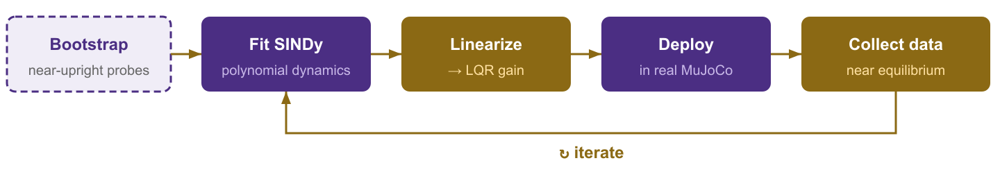
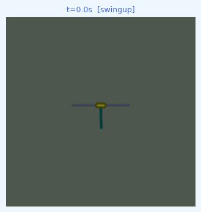

<!-- ─────────────────────────────────────────────────
  SLIDE 1 · TITLE
───────────────────────────────────────────────── -->
<!-- _class: title -->
<!-- _paginate: false -->
<!-- _footer: '' -->

W

# Interpretable Control for Unstable Systems via SINDy&#8209;RL

**Patrick Smith &nbsp;·&nbsp; Andrew Falcone**

ME 595 &nbsp;·&nbsp; University of Washington &nbsp;·&nbsp; Spring 2026

---

<!-- ─────────────────────────────────────────────────
  SLIDE 2 · THE VISION
  Patrick — 1:00
───────────────────────────────────────────────── -->

# What if the controller was just an equation?

 

$$u(x) = \underbrace{-2.4\,\theta_1}_{\text{balance}}
       - \underbrace{0.9\,\theta_2}_{\text{balance}}
       - \underbrace{0.5\,\dot\theta_1}_{\text{damp}}
       - \underbrace{0.2\,\dot\theta_2}_{\text{damp}}
       + \cdots$$

 

8 terms &nbsp;·&nbsp; every coefficient has a physical interpretation &nbsp;·&nbsp; fits on a napkin

---

<!-- ─────────────────────────────────────────────────
  SLIDE 3 · THE SYSTEM
  Andrew — 0:40
───────────────────────────────────────────────── -->

# The Inverted Double Pendulum

**State** &nbsp; $x \in \mathbb{R}^6$

$$x = \begin{bmatrix} x_{\text{cart}} \\ \theta_1 \\ \theta_2 \\ \dot x_{\text{cart}} \\ \dot\theta_1 \\ \dot\theta_2 \end{bmatrix}$$

**Action** &nbsp; $u \in [-1,\,1]$ — cart force

**Unstable equilibrium** at $\theta_1 = \theta_2 = 0$

  L₁ = L₂ = 0.6 m &nbsp;·&nbsp; dt = 0.05 s &nbsp;·&nbsp; MuJoCo physics

---

<!-- ─────────────────────────────────────────────────
  SLIDE 4 · SINDY
  Andrew — 0:55
───────────────────────────────────────────────── -->

# SINDy — Discovering equations from data

**Key idea:** dynamics live in a low-dimensional function space.

$$\dot X \;=\; \underbrace{\Theta(X,U)}_{\substack{\text{candidate} \\ \text{feature library}}} \cdot \underbrace{\Xi}_{\substack{\text{sparse} \\ \text{coefficients}}}$$

$$\Theta = \bigl[\;1 \;\big|\; x \;\big|\; \theta_1,\,\theta_2 \;\big|\; x^2,\,x\theta_1,\,\theta_1^2,\;\ldots\;\bigr] \quad \text{degree-}d\text{ polynomial library}$$

<b>STLSQ solver</b> drives most coefficients to <em>exactly zero</em> —  leaving a sparse equation with only the dominant governing terms.

<b>Library degree <em>d</em> is a design choice</b> — it must match the complexity of the system and is not obvious a priori.

  Lineage: &nbsp;
  LASSO '96
  &nbsp;→&nbsp; SINDy '16
  &nbsp;→&nbsp; SINDy-C '18
  &nbsp;→&nbsp; E-SINDy '22
  &nbsp;→&nbsp; <strong>SINDy-RL '24</strong>
  &nbsp;&nbsp;|&nbsp;&nbsp; Koopman as the competing paradigm

---

<!-- ─────────────────────────────────────────────────
  SLIDE 5 · OBJECTIVES
  Both — 0:35
───────────────────────────────────────────────── -->

# Two objectives — one interpretable controller

---

<!-- ─────────────────────────────────────────────────
  SLIDE 6 · CHICKEN-AND-EGG
  Both — 0:50
───────────────────────────────────────────────── -->

# SINDyC is a chicken-and-egg problem

You can't train near equilibrium without reaching it — and you can't reach it without a controller.

  Solution: co-train the controller and surrogate in an iterative active-learning loop.

---

<!-- ─────────────────────────────────────────────────
  SLIDE 7 · BASELINE
  Patrick — 0:30
───────────────────────────────────────────────── -->

# Baseline — the performance ceiling

A standard PPO agent trained with **full simulator access**.

  
100%

  
Task success rate (20/20 eval episodes)

  
9359

  
Mean reward (max possible ≈ 10,000)

  
9,731

  
Policy parameters MLP [64 × 64]

  <strong>50,000 transitions</strong> collected from the trained policy — the dataset used for sparse learning.

---

<!-- ─────────────────────────────────────────────────
  SLIDE 8 · SPARSE POLICY DISTILLATION
  Patrick — 0:50
───────────────────────────────────────────────── -->

# Sparse policy distillation — the compounding error trap

**Behavioral cloning** on the oracle dataset:

$$\min_{\Xi} \;\bigl\|\Theta(X)\,\Xi - U^*\bigr\|_2 \;+\; \lambda\|\Xi\|_1$$

Degree-4 library: 210 terms → STLSQ selects **8 terms** ✓

**But the policy fails in deployment.**

  At noise σ = 0.3 : <strong>1000 steps → ~20 steps</strong>

| Noise σ | Mean episode length |
|---|---|
| 0 (training) | ~1000 steps ✓ |
| 0.1 | ~200 steps |
| 0.3 | ~20 steps ✗ |

  Off-distribution states produce small action errors → errors compound → catastrophic failure.

---

<!-- ─────────────────────────────────────────────────
  SLIDE 9 · THE FIX
  Patrick — 0:40
───────────────────────────────────────────────── -->

# The fix: query the oracle, for free

**Key insight:** the NN policy is a pure function of state — no memory, no rollouts needed. Query it at *any* state we choose.

For each of 3 rounds:

1. Perturb states: $\tilde x = x + \varepsilon,\;\;\varepsilon \sim \mathcal{N}(0,\,\sigma^2)$
2. Query oracle: $\tilde u = \pi_\text{NN}(\tilde x)$
3. Append $(\tilde x,\tilde u)$ to dataset

Dataset grows **4×** (50k → 200k pairs). STLSQ re-fit recovers cross-coupling terms.

|  | σ = 0.1 | σ = 0.3 |
|---|---|---|
| Base policy | ~200 steps | ~20 steps ✗ |
| Augmented | ~1000 steps ✓ | ~500–900 steps |

Baseline NN: 1000 steps at all noise levels

  <strong>25–45× more robust</strong> — zero additional simulator interactions.

  R²≈0.97 ceiling: Tanh NN ≠ polynomial — structural mismatch. 
  ✓ <strong>Polynomial actor</strong>: degree-2 library, 44→22 terms (STLSQ) → R² = 0.999, 1000/1000 steps at all noise.

---

<!-- ─────────────────────────────────────────────────
  SLIDE 10 · ROM SURROGATE — ACTIVE LOOP
  Andrew — 0:50
───────────────────────────────────────────────── -->

# ROM surrogate — SINDy dynamics + LQR control

  <strong>PPO Policy learned on SINDy fails in deployment</strong>  
  PPO found a policy that scored well <em>inside the polynomial</em> — by exploiting its approximation errors. Those actions don't generalize to the real system: <strong>24</strong> steps average in MuJoCo.

  <strong>Why LQR transfers</strong>  
  LQR only uses the <em>Jacobian at the upright fixed point</em>. Near equilibrium, that linearization is accurate in both the polynomial model and the real system — so there are no model errors to exploit.

---

<!-- ─────────────────────────────────────────────────
  SLIDE 11 · ROM RESULTS
  Andrew — 0:40
───────────────────────────────────────────────── -->

# ROM surrogate — results

**SINDy RMSE convergence** (fixed validation set):

| Iteration | RMSE | Cumulative transitions |
|---|---|---|
| 0 (bootstrap) | 0.188 | 5,000 |
| 1 | 0.182 | 10,000 |
| 2 | 0.085 | 15,000 |

  Baseline NN: <strong>400,000</strong> real-sim steps. 
  SINDy-LQR: <strong>15,000</strong> — <strong>27× more data-efficient.</strong>

**LQR transfer — real MuJoCo evaluation** (10 episodes per iteration):

| Iteration | Mean return | Mean length | Success |
|---|---|---|---|
| 0 | 9359.88 | 1,000 | 100% |
| 1 | 9359.87 | 1,000 | 100% |
| 2 | 9359.90 | 1,000 | 100% |

  LQR gain computed from SINDy linearized around upright. 
  Mean return matches the full-order baseline (9,359) exactly.

---

<!-- ─────────────────────────────────────────────────
  SLIDE 12 · COMPARISON
  Both — 0:40
───────────────────────────────────────────────── -->

# How do they compare?

| Approach | Real-sim steps | Policy type | Mean length | Success | Interpretable |
|---|---|---|---|---|---|
| **Baseline NN** | 400,000 | NN (9,731 params) | 1,000 | 100% | ✗ |
| **Sparse policy (base)** | 400,000* | Polynomial (8 terms) | ~20 @ σ=0.3 | Low | ✓ |
| **Sparse policy (augmented)** | 400,000* | Polynomial (8 terms) | ~500–900 | ~50–90% | ✓ |
| **Polynomial actor** | 1,000,000 | Polynomial (22 terms) | **1,000** | **100%** | ✓ |
| **SINDy + PPO-in-surrogate** | ~15,000 | PPO (NN) | ~24 | ~0% | ✗ |
| **SINDy-LQR** | **15,000** | LQR from SINDy | **1,000** | **100%** | ✓ |
| **Phase 3 (stretch)** | TBD | Polynomial | — | — | ✓ |

  * Inherits baseline training data — no additional agent training, one-shot regression from oracle queries.

---

<!-- ─────────────────────────────────────────────────
  SLIDE 13 · STRETCH GOAL
───────────────────────────────────────────────── -->
<!-- _backgroundColor: #F0EDF7 -->

# Stretch Goal

### Phase 3 · Fully Interpretable Closed-Loop Control

 

Combine the interpretable **dynamics** (ROM) with the interpretable **policy** (sparse dictionary)

---

<!-- ─────────────────────────────────────────────────
  SLIDE 14 · BONUS
───────────────────────────────────────────────── -->
<!-- _backgroundColor: #F0EDF7 -->

# Bonus Stretch Goal

### For Fun

<strong>2</strong> chained PPO policies: swing-up (energy pumping) + stabilizer.

<strong>NN baseline:</strong> Swing-up PPO → handoff → Stabilizer PPO 304 steps &nbsp;·&nbsp; 15.2 s &nbsp;·&nbsp; <strong>SUCCESS</strong>

<strong>Goal:</strong> reproduce this with SINDy-RL — interpretable swing-up + interpretable stabilizer, end to end.

---

<!-- ─────────────────────────────────────────────────
  SLIDE 15 · CLOSING
  Andrew — 0:15
───────────────────────────────────────────────── -->
<!-- _class: title -->
<!-- _paginate: false -->
<!-- _footer: '' -->

W

# Interpretable control for unstable systems.
# It works.

**Patrick Smith &nbsp;·&nbsp; Andrew Falcone**

ME 595 &nbsp;·&nbsp; University of Washington &nbsp;·&nbsp; Spring 2026
