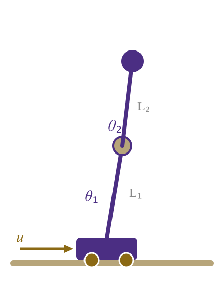
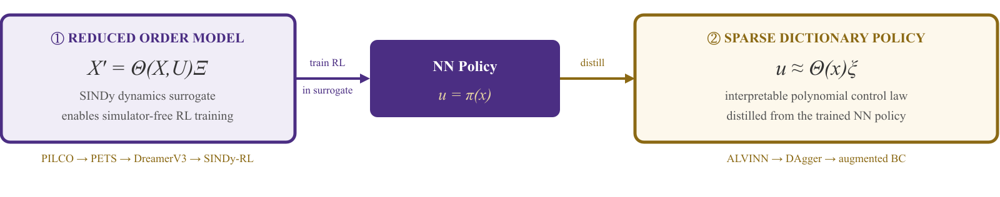
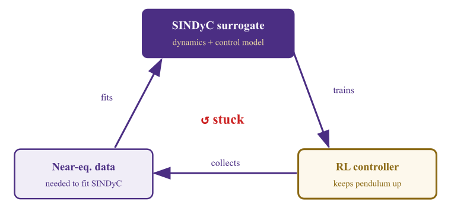
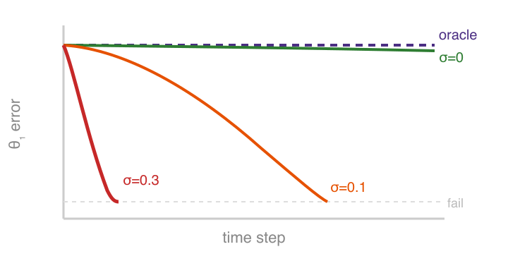
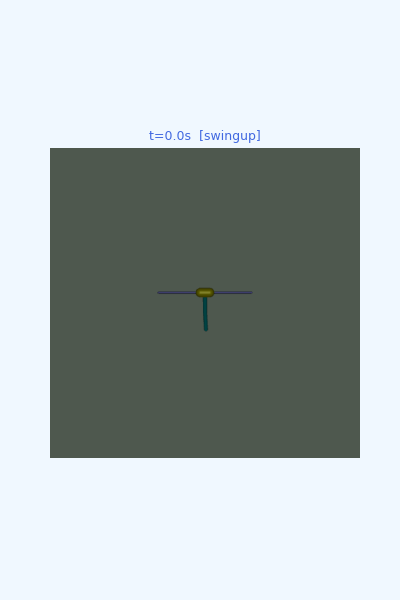

<!-- ─────────────────────────────────────────────────
  SLIDE 1 · TITLE
───────────────────────────────────────────────── -->
<!-- _class: title -->
<!-- _paginate: false -->
<!-- _footer: '' -->

W

# Interpretable Control for Unstable Systems via SINDy-RL

**Patrick Smith &nbsp;·&nbsp; Andrew Falcone**

ME 595 &nbsp;·&nbsp; University of Washington &nbsp;·&nbsp; Spring 2026

---

<!-- ─────────────────────────────────────────────────
  SLIDE 2 · THE VISION
  Patrick — 1:00
───────────────────────────────────────────────── -->

# What if the controller was just an equation?

 

$$u(x) = \underbrace{-2.4\,\theta_1}_{\text{balance}}
       - \underbrace{0.9\,\theta_2}_{\text{balance}}
       - \underbrace{0.5\,\dot\theta_1}_{\text{damp}}
       - \underbrace{0.2\,\dot\theta_2}_{\text{damp}}
       + \cdots$$

 

8 terms &nbsp;·&nbsp; every coefficient has a physical interpretation &nbsp;·&nbsp; fits on a napkin

---

<!-- ─────────────────────────────────────────────────
  SLIDE 3 · THE SYSTEM
  Andrew — 0:40
───────────────────────────────────────────────── -->

# The Inverted Double Pendulum

**State** &nbsp; $x \in \mathbb{R}^6$

$$x = \begin{bmatrix} x_{\text{cart}} \\ \theta_1 \\ \theta_2 \\ \dot x_{\text{cart}} \\ \dot\theta_1 \\ \dot\theta_2 \end{bmatrix}$$

**Action** &nbsp; $u \in [-1,\,1]$ — cart force

**Unstable equilibrium** at $\theta_1 = \theta_2 = 0$

  L₁ = L₂ = 0.6 m &nbsp;·&nbsp; dt = 0.05 s &nbsp;·&nbsp; MuJoCo physics

---

<!-- ─────────────────────────────────────────────────
  SLIDE 4 · SINDY
  Andrew — 0:55
───────────────────────────────────────────────── -->

# SINDy — Discovering equations from data

**Key idea:** dynamics live in a low-dimensional function space.

$$\dot X \;=\; \underbrace{\Theta(X,U)}_{\substack{\text{candidate} \\ \text{feature library}}} \cdot \underbrace{\Xi}_{\substack{\text{sparse} \\ \text{coefficients}}}$$

$$\Theta = \bigl[\;1 \;\big|\; x \;\big|\; \theta_1,\,\theta_2 \;\big|\; x^2,\,x\theta_1,\,\theta_1^2,\;\ldots\;\bigr] \quad \text{degree-}d\text{ polynomial library}$$

<b>STLSQ solver</b> drives most coefficients to <em>exactly zero</em> — exposing the true governing terms.

<b>Library degree <em>d</em> is a design choice</b> — it must match the complexity of the system and is not obvious a priori.

  Lineage: &nbsp;
  LASSO '96
  &nbsp;→&nbsp; SINDy '16
  &nbsp;→&nbsp; SINDy-C '18
  &nbsp;→&nbsp; E-SINDy '22
  &nbsp;→&nbsp; <strong>SINDy-RL '24</strong>
  &nbsp;&nbsp;|&nbsp;&nbsp; Koopman as the competing paradigm

---

<!-- ─────────────────────────────────────────────────
  SLIDE 5 · OBJECTIVES
  Both — 0:35
───────────────────────────────────────────────── -->

# Two objectives — one interpretable controller

 
 

---

<!-- ─────────────────────────────────────────────────
  SLIDE 6 · CHICKEN-AND-EGG
  Both — 0:50
───────────────────────────────────────────────── -->

# SINDyC is a chicken-and-egg problem

You can't train near equilibrium without reaching it — and you can't reach it without a controller.

  Solution: co-train the controller and surrogate in an iterative active-learning loop.

---

<!-- ─────────────────────────────────────────────────
  SLIDE 7 · BASELINE
  Patrick — 0:30
───────────────────────────────────────────────── -->

# Baseline — the performance ceiling

A standard PPO agent trained with **full simulator access**.

  
100%

  
Task success rate (20/20 eval episodes)

  
9359

  
Mean reward (max possible ≈ 10,000)

  
9,731

  
Policy parameters MLP [64 × 64]

  <strong>50,000 transitions</strong> collected from the trained policy — the dataset used for sparse learning.

---

<!-- ─────────────────────────────────────────────────
  SLIDE 8 · SPARSE POLICY DISTILLATION
  Patrick — 0:50
───────────────────────────────────────────────── -->

# Sparse policy distillation — the compounding error trap

**Behavioral cloning** on the oracle dataset:

$$\min_{\Xi} \;\bigl\|\Theta(X)\,\Xi - U^*\bigr\|_2 \;+\; \lambda\|\Xi\|_1$$

Degree-4 library: 210 terms → STLSQ selects **8 terms** ✓

**But the policy fails in deployment.**

  At noise σ = 0.3 rad: <strong>1000 steps → ~20 steps</strong>

| Noise σ | Mean episode length |
|---|---|
| 0 (training) | ~1000 steps ✓ |
| 0.1 rad | ~200 steps |
| 0.3 rad | ~20 steps ✗ |

  Off-distribution states produce small action errors → errors compound → catastrophic failure.

---

<!-- ─────────────────────────────────────────────────
  SLIDE 9 · THE FIX
  Patrick — 0:40
───────────────────────────────────────────────── -->

# The fix: query the oracle, for free

**Key insight:** the NN policy is a pure function of state — no memory, no rollouts needed. Query it at *any* state we choose.

For each of 3 rounds:

1. Perturb states: $\tilde x = x + \varepsilon,\;\;\varepsilon \sim \mathcal{N}(0,\,0.15^2)$
2. Query oracle: $\tilde u = \pi_\text{NN}(\tilde x)$
3. Append $(\tilde x,\tilde u)$ to dataset

Dataset grows **4×** (50k → 200k pairs). STLSQ re-fit recovers cross-coupling terms.

|  | σ = 0.1 | σ = 0.3 |
|---|---|---|
| Base policy | ~200 steps | ~20 steps ✗ |
| Augmented | ~1000 steps ✓ | ~500–900 steps |

Baseline NN: 1000 steps at all noise levels

  <strong>25–45× more robust</strong> — zero additional simulator interactions.

  R²≈0.97 ceiling: Tanh NN ≠ polynomial — structural mismatch. 
  ✓ <strong>Polynomial actor</strong>: degree-2 library, 44→22 terms (STLSQ) → R² = 0.999, 1000/1000 steps at all noise.

---

<!-- ─────────────────────────────────────────────────
  SLIDE 10 · ROM SURROGATE — ACTIVE LOOP
  Andrew — 0:50
───────────────────────────────────────────────── -->

# ROM surrogate — train RL inside an interpretable model

**Core idea:** use a SINDy surrogate as the "dream environment" (cf. DreamerV3).

 

  
Bootstrap <small>PD + random</small>

  
→

  
Fit SINDy <small>polynomial dynamics</small>

  
→

  
Train PPO <small>in surrogate</small>

  
→

  
Deploy <small>in real sim</small>

  
→

  
Collect data <small>near equilibrium</small>

  
→

  
⟳

 

| DreamerV3 concept | This project |
|---|---|
| Latent world model (RSSM) | SINDy surrogate — explicit, interpretable |
| "Dreaming" (policy training) | PPO in `SINDySurrogateEnv` |
| World model update | Refit SINDy on expanded dataset |
| Real-env interaction | Controller rollout in MuJoCo |

---

<!-- ─────────────────────────────────────────────────
  SLIDE 11 · ROM RESULTS
  Andrew — 0:40
───────────────────────────────────────────────── -->

# ROM surrogate — results

**Iterative RMSE convergence:**

| Iteration | One-step RMSE | Real sim steps |
|---|---|---|
| 0 (bootstrap) | — | ~3,000 |
| 1 | Δ large | +~5,000 |
| 2 | Δ small | +~5,000 |

  Each iteration trains a better policy which collects better data.

  Baseline NN required <strong>400,000</strong> real-sim steps. 
  ROM surrogate target: <strong>&lt; 50,000</strong> — 8× more data-efficient.

**Surrogate environment** — exact reward replica:

$$r = 10 - \bigl(0.01\,x_\text{tip}^2 + (y_\text{tip}-2)^2\bigr) - v_\text{pen}$$

$$y_\text{tip} = L_1\cos\theta_1 + L_2\cos(\theta_1+\theta_2)$$

The SINDy model is **interpretable dynamics**:

$$x_{k+1} = x_k + \Delta t \cdot \Xi^T \Theta(x_k, u_k)$$

---

<!-- ─────────────────────────────────────────────────
  SLIDE 12 · COMPARISON
  Both — 0:40
───────────────────────────────────────────────── -->

# How do they compare?

| Approach | Real-sim steps | Policy type | Mean length | Success | Interpretable |
|---|---|---|---|---|---|
| **Baseline NN** | 400,000 | NN (9,731 params) | 1,000 | 100% | ✗ |
| **Sparse policy (base)** | 400,000 | Polynomial (8 terms) | ~20 @ σ=0.3 | Low | ✓ |
| **Sparse policy (augmented)** | 400,000* | Polynomial | ~500–900 | ~50–90% | ✓ |
| **ROM surrogate RL** | ~50,000 (est.) | NN in surrogate | TBD | TBD | ◑ |
| **Phase 3 (stretch)** | TBD | Polynomial | — | — | ✓ |

  * No additional real-sim steps beyond baseline training — augmentation uses oracle queries only.

---

<!-- ─────────────────────────────────────────────────
  SLIDE 16 · STRETCH GOAL
───────────────────────────────────────────────── -->
<!-- _class: section -->

# Stretch Goal

### Phase 3 · Fully Interpretable Closed-Loop Control

Combine the interpretable **dynamics** (ROM) with the interpretable **policy** (sparse dictionary)

---

<!-- ─────────────────────────────────────────────────
  SLIDE 13 · Bonus
───────────────────────────────────────────────── -->

# Bonus

Make it works from down initial position

**Currently**: Swing-up PPO → handoff → Stabilizer PPO &nbsp;·&nbsp; 304 steps (15.2 s) &nbsp;·&nbsp; <strong>SUCCESS</strong>

---

<!-- ─────────────────────────────────────────────────
  SLIDE 14 · CLOSING
  Andrew — 0:15
───────────────────────────────────────────────── -->
<!-- _class: title -->
<!-- _paginate: false -->
<!-- _footer: '' -->

W

# Interpretable control for unstable systems.
# It works.

**Patrick Smith &nbsp;·&nbsp; Andrew Falcone**

ME 595 &nbsp;·&nbsp; University of Washington &nbsp;·&nbsp; Spring 2026
