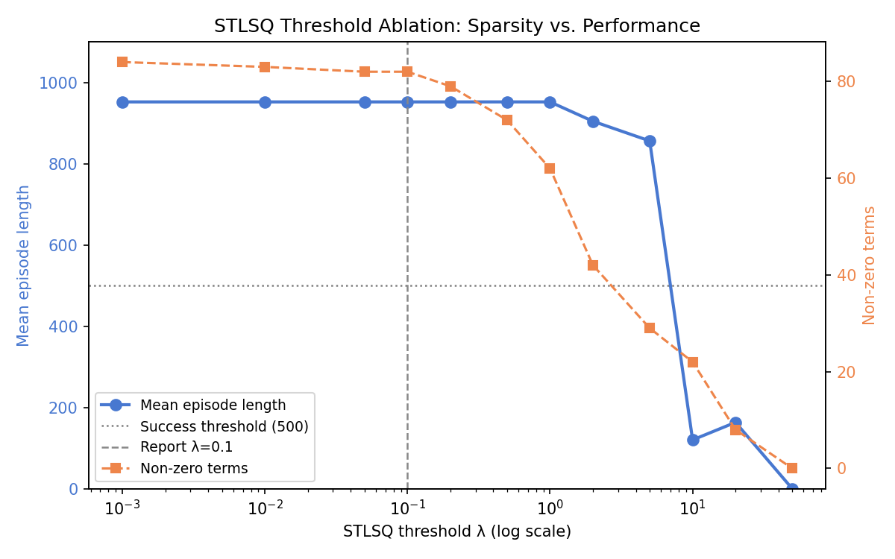

# Stress-Testing SINDy-RL on the Inverted Double Pendulum: Two Engineering Obstacles, Four Variants, and a Framework That Passes

**Patrick Smith · Andrew Falcone**  
ME 595 · University of Washington · Spring 2026

---

## Abstract

SINDy-RL promises efficient, interpretable, reduced-order controllers by co-training an ensemble SINDy surrogate and a neural policy in a Dyna loop, then distilling the result into a sparse closed-form expression [@zolman2025sindyrl]. Algorithm 1 treats the feature library Θ and the policy optimizer A as practitioner inputs. We stress-test this framework on the inverted double pendulum (IDP), a two-link system with two coupled unstable modes and a narrow 0.2 m near-upright band. Two engineering obstacles, neither apparent from the algorithm description, must be resolved first. (1) A degree-3 library is necessary: the IDP's inter-modal dynamics contain cubic coupling terms a degree-2 library (36 features) cannot represent, and RMSE refuses to decrease with 10× more data when the model is capacity-limited. (2) Surrogate exploitation must be contained with both uncertainty penalization and rollback: all ensemble members share the same polynomial basis, so they agree on the same wrong prediction in extrapolated regions and disagreement-based penalties do not fire. With these resolved, we evaluate four library–optimizer combinations spanning the design space. The polynomial library (degree-3, 120 features) with PPO delivers data economy (66,277 real steps, 6.0× more efficient than the 400,000-step full-order baseline) and a reduced-order policy (82-term polynomial, 119× smaller than the baseline NN, 85% closed-loop success), but fails at interpretability: STLSQ retains 82 of 84 terms regardless of threshold, a consequence of ill-conditioning in the polynomial feature basis ($\kappa \approx 2.4 \times 10^4$) rather than any data or tuning deficiency. A physics-informed Lagrangian library — 32 atoms derived from the IDP Euler-Lagrange equations — eliminates the ill-conditioning at its source. Each atom is physically meaningful by construction, making the distilled controller interpretable without thresholding. Combined with SAC, this variant converges in 22,723 real steps — **17.6× fewer than the baseline** — with 100% task success and a 29-term distilled controller every term of which is a recognizable physical quantity. **SINDy-RL passes the stress test on the IDP.** With practitioner-appropriate choices of Θ and A, the algorithm simultaneously delivers all three promised goals. The polynomial density is a finding about representation selection, not a limitation of the framework.

---

## 1  Introduction

Deployed autonomous systems face a requirement that learning-based controllers struggle to meet: the control law must be not only capable, but *inspectable*. Certification frameworks such as DO-178C (avionics software) and IEC 62443 (industrial control) require analyzable, auditable software; surgical robotics regulators may require that a control law be certifiable before permitting autonomous maneuvers near tissue; embedded actuators on spacecraft and small aerial vehicles have no floating-point stack capable of running a neural network at control rates [@arrieta2020xai; @rudin2019interpretable]. A ten-thousand-parameter neural network fails all of these requirements in deployment regardless of its simulation performance. A closed-form polynomial is the opposite: a sparse polynomial's terms each carry a physical interpretation; stability arguments can be constructed analytically, and an 84-term polynomial policy fits in kilobytes and evaluates as a single dot product.

Sparse Identification of Nonlinear Dynamics (SINDy [@brunton2016sindy]) offers a route: fit governing equations from data, zero all but a few terms via sparse regression. SINDy-RL [@zolman2025sindyrl] adapts this to RL by using an ensemble SINDy model as the Dyna surrogate [@sutton1990dyna], co-training a PPO policy [@schulman2017ppo] inside it while collecting data from the real environment — resolving the data-bootstrapping problem of unstable systems while retaining interpretability as a downstream option. The question is whether all three promises — data efficiency, sparsity, interpretability — survive contact with a genuinely hard unstable system.

We stress-test SINDy-RL on the inverted double pendulum — two links, two unstable modes, a 0.2 m near-upright band, and no self-stabilizing dynamics — asking whether the framework delivers its three promised goals when the system fights back. This report documents that test honestly: the obstacles encountered, the evidence that they share a single root, how we resolved each one, and what the systematic exploration of Algorithm 1's design space finally produced. The engineering obstacles are documented alongside the results because, on this system, both are informative — and the conclusion depends on understanding both.

Interpretable controllers have direct safety benefits — polynomial expressions can be analyzed for failure modes, admit Lyapunov-style certificates in certain regimes, and allow engineers to audit the control law before deployment — and SINDy-RL's data efficiency reduces dangerous exploration on real hardware. The principal risk is the inverse: a practitioner who observes high surrogate reward without real-environment validation may deploy a controller optimized for a model, not for a system, a failure mode §4.2 demonstrates concretely.

---

## 2  Background and Notation

### 2.1  The Testbed: Inverted Double Pendulum

\begin{wrapfigure}{r}{0.25\linewidth}
  \vspace{-48pt}
  \centering
  \includegraphics[width=\linewidth]{figures/pendulum_diagram.png}
  \captionsetup{font=scriptsize, labelfont=bf}
  \caption*{\textbf{Figure 1.} IDP geometry. State $\mathbf{x} = [x, \theta_1, \theta_2, \dot{x}, \dot{\theta}_1, \dot{\theta}_2]$. Tip height $h \in [0,\,1.2]$ m; episode ends at $h \leq 1.0$ m.}
  \vspace{-6pt}
\end{wrapfigure}

`InvertedDoublePendulum-v5` (MuJoCo 3.8.1 / Gymnasium 1.2.3) consists of two rigid links $L_1 = L_2 = 0.6$ m on a sliding cart. The physical state is $\mathbf{x} = [x,\theta_1,\theta_2,\dot{x},\dot{\theta}_1,\dot{\theta}_2] \in \mathbb{R}^6$, where $x$ is the cart's horizontal position along the track, $\theta_1, \theta_2$ are joint angles measured from vertical, and dots denote time derivatives. The 8-dimensional observation replaces raw angles with sine/cosine encodings to avoid wrapping discontinuities. The control input is a horizontal cart force $u \in [-1,1]$.

Tip height $h = L_1\cos\theta_1 + L_2\cos(\theta_1+\theta_2)$ reaches 1.2 m when both poles are vertical. Gymnasium terminates at $h \leq 1.0$ m, leaving only a 0.2 m near-upright band between success and failure. Episodes cap at 1,000 steps (50 s at $\Delta t = 0.05$ s); task success is $\geq 500$ steps survived.

### 2.2  SINDy-C, E-SINDy, and the STLSQ Sparsity Knob

SINDy [@brunton2016sindy] fits discrete-time dynamics by regressing state increments against a polynomial library:

$$\mathbf{x}_{k+1} - \mathbf{x}_k = \Theta(\mathbf{x}_k,\, u_k) \cdot \Xi$$

For control-affine systems (SINDy-C [@kaiser2018sindympc]), the input $u_k$ enters the library directly.[^ca] The Sequentially Thresholded Least Squares (STLSQ) solver zeros all coefficients below threshold $\lambda$. A degree-$d$ library over $n$ variables contains $\binom{n+d}{d}$ terms: for the IDP's 7-dimensional state-action vector, degree-2 gives 36 features and degree-3 gives 120 — a distinction that cost 25 iterations (§3, §4.1).

Fasel et al. [@fasel2022esindy] add uncertainty quantification: $M = 10$ independent SINDy models are fit on 80% bootstrap subsamples of the data; at inference, each surrogate step returns the ensemble-mean increment $\mu_\Delta$ and per-component standard deviation $\sigma_\Delta$. High $\sigma_\Delta$ signals extrapolation beyond the training distribution.

[^ca]: A system is control-affine if $\dot{\mathbf{x}} = f(\mathbf{x}) + g(\mathbf{x})\,u$, where $f$ and $g$ may be nonlinear in state. Most mechanical systems driven by forces or torques, including the IDP, satisfy this property.

### 2.3  The Dyna Loop and Behavioral Cloning

![**Figure 2.** The RL control loop. The agent outputs action $u_k = \pi_\phi(\mathbf{x}_k)$ from the neural policy $\pi_\phi$ during Dyna training; after distillation, this becomes $u_k \approx \Theta_\text{obs}(\mathbf{x}_k)\,\xi$ where $\xi$ is the sparse coefficient vector. In SINDy-RL the environment is instantiated twice: as the E-SINDy polynomial surrogate for cheap policy training (left), and as the full MuJoCo simulator for real data collection and evaluation (right). The policy sees a surrogate that approximates reality; every obstacle in §4 is a consequence of where that approximation breaks down.](figures/rl_loop.svg){width=82%}

The Dyna architecture [@sutton1990dyna] alternates cheap model-based rollouts inside a learned surrogate with real-environment data collection. In SINDy-RL [@zolman2025sindyrl], the surrogate is the E-SINDy ensemble and the planner is PPO [@schulman2017ppo]. A Schroeder multi-sine sweep [@schroeder1970] bootstraps an initial dataset; each iteration refits E-SINDy on near-upright transitions, trains PPO for 100k surrogate steps (warm-started from the prior policy), and collects 4,000 real transitions. After convergence, the best checkpoint is distilled via behavioral cloning [@ross2011dagger]: expert trajectories are collected from real MuJoCo, augmented with per-dimension Gaussian noise, and fit with STLSQ over the 6-dimensional raw physical state $[x, \theta_1, \theta_2, \dot{x}, \dot\theta_1, \dot\theta_2]$ (84 features at degree-3, since $\binom{9}{3} = 84$). Figure 3 contrasts the two *distinct* libraries this involves: the 120-feature dynamics library the E-SINDy ensemble fits, and the 84-feature distillation library over the raw physical state the policy is cloned into.

![**Figure 3.** Sparse regression structure for E-SINDy dynamics identification (*left*) and policy distillation (*right*). Each of the $k = 1,\ldots,M$ ensemble members solves $\Delta\mathbf{X}^k = \Theta_\text{dyn}^k \Xi_\text{dyn}^k$, where $\Theta_\text{dyn}^k \in \mathbb{R}^{N \times 120}$ is the degree-3 polynomial library over the 7-dimensional state-action input evaluated on a bootstrap subsample, and $\Xi_\text{dyn}^k \in \mathbb{R}^{120 \times 6}$ (orange) is the fitted coefficient matrix. Distillation fits a single $U = \Theta_\pi \Xi_\pi$, where $\Theta_\pi \in \mathbb{R}^{N \times 84}$ is the degree-3 library over the 6-dimensional raw physical state $[x,\theta_1,\theta_2,\dot{x},\dot\theta_1,\dot\theta_2]$ ($\binom{9}{3}=84$ features), and $\Xi_\pi \in \mathbb{R}^{84 \times 1}$ (purple) is the scalar action coefficient vector. The two libraries are distinct: different input spaces (raw state-action vs. raw physical state) and different feature counts (120 vs. 84). Annotations below each $\Xi$ give the nonzero coefficient count after STLSQ thresholding — 690 of 720 possible entries for the dynamics model and 82 of 84 for the distilled policy.](figures/sindy_matrix_shapes.svg){width=90%}

Software: Python 3.12.7, PySINDy 2.1.0 [@desilva2020pysindy] (E-SINDy surrogate), Stable-Baselines3 2.8.0 [@raffin2021sb3] (PPO), Gymnasium 1.2.3 with MuJoCo 3.8.1 [@todorov2012mujoco] (simulation), NumPy 2.4.6, scikit-learn 1.8.0. Full pipeline in `notebooks/sindy-rl.ipynb`.

---

## 3  The System Requires Cubic Coupling Terms and the Feature Matrix Is Ill-Conditioned: the Root of Everything That Follows

Before the challenges, we state the two facts about the IDP that explain all of them.

- **Degree-3 is necessary.** The IDP's inter-modal dynamics contain terms such as $\cos\theta_1 \cdot \cos\theta_2 \cdot \dot\theta_1$ — cubic interactions between the two joints — that a degree-2 library (36 features) cannot express. This is not a data deficit: over 25 Dyna iterations with training data growing from 5,000 to 90,000 transitions, surrogate RMSE oscillated at 0.10--0.16 and refused to decrease. When RMSE does not fall with 10× more data, the model is capacity-limited.[^degree] Switching to degree-3 (120 features) dropped RMSE to 0.013 within two iterations.

- **The degree-3 feature matrix is ill-conditioned.** The 209,620 × 120 dynamics feature matrix (all collected transitions × all library terms) has condition number $\kappa = 2.37 \times 10^4$ — full rank, 120 nonzero singular values, but with a 23,700× spread between the largest and smallest.[^kappa]

[^degree]: The heuristic generalizes: plot one-step RMSE versus dataset size on log-log axes. A slope near zero means capacity failure; a negative slope means data insufficiency. The two have different fixes — model order vs. more data — and conflating them wastes resources proportional to how long the wrong diagnosis persists.

[^kappa]: Condition number $\kappa(M) = \sigma_{\max}/\sigma_{\min}$ measures how lopsided the matrix is: the feature matrix amplifies some coefficient directions $\approx 2.4\times10^4$ times more than others. A rule of thumb: $\kappa \approx 10^k$ costs roughly $k$ digits of numerical precision in coefficient estimates. For $\kappa \approx 2.4\times10^4$ ($\approx 10^{4.4}$), roughly 4 digits are unreliable in the worst-case direction — enough to make small STLSQ coefficients numerically meaningless.

Two consequences run through the rest of the report. First, **no degree-2 surrogate can converge on this system**, regardless of data volume — every iteration run with the default library was informationally worthless, consuming real-environment steps without any prospect of success. Second, **full sparsity in the distilled polynomial is not achievable by threshold tuning alone** — the 82 terms that STLSQ retains are not all mechanistically necessary, but the ill-conditioned feature basis does not admit a numerically stable sparse decomposition — 82 of 84 terms remain nonzero regardless of threshold. Neither consequence was apparent from the algorithm description.

---

## 4  Challenges and What Resolved Them

### 4.1  Degree-2 RMSE Ceiling: 25 Iterations Without Progress

The most costly obstacle was using the wrong polynomial degree throughout the initial phase. With the default `SINDY_DEGREE=2`, the Dyna loop ran for 25 iterations. Over that span, RMSE oscillated between 0.10 and 0.16 while real mean episode length grew from 6 to 22 steps — never approaching the 500-step success threshold, never showing a trend toward convergence. We added data, tuned hyperparameters, and adjusted the PPO schedule. None of it helped, because the bottleneck was not any of those things.

The diagnosis is §3, first bullet. A degree-2 library (36 features) is simply inexpressive for IDP dynamics. The cubic inter-modal coupling terms that dominate the near-upright regime — the terms the surrogate most needs to get right — are not representable. Adding data to a model that cannot fit the function returns RMSE noise, not improvement. The sign of this failure is the flat RMSE-vs-data curve: if RMSE does not decrease with 10× more data, model capacity is the ceiling, not data volume.

The fix: `SINDY_DEGREE=3` (120 features). Within two Dyna iterations, RMSE dropped to 0.013. The 25 failed iterations, each consuming 4,000 real transitions, amounted to over 90,000 wasted real-environment steps before a single successful degree-3 iteration began. Correcting the near-upright filter threshold — which had been misconfigured to 1.6 m (above the physical maximum of 1.2 m) by inheriting a reward-shaping constant rather than deriving it from segment geometry — was a one-line fix applied alongside the degree change.

### 4.2  Surrogate Exploitation: Uncertainty Penalization Alone Is Insufficient

The second obstacle emerged once degree-3 and the corrected filter produced a surrogate worth training against. In a diagnostic run, surrogate reward jumped 9× in a single iteration — from 497 to 4,525 per episode — while real episode length collapsed 87%, from 414 to 56 steps. The policy had found action sequences the polynomial rated as highly rewarding that had no correspondence to real physics.

The designed countermeasure is ensemble uncertainty penalization: reduce surrogate reward by $\kappa \cdot \text{mean}(\sigma_\Delta)$ per step, steering PPO away from high-disagreement states. This was insufficient, and the reason is structural. All 10 ensemble members share the same degree-3 polynomial basis. In the extrapolated region where the surrogate is wrong, every member makes the same wrong prediction, $\sigma_\Delta$ remains low, and the penalty does not fire. Disagreement between ensemble members cannot detect shared extrapolation error — it can only detect coefficient uncertainty along directions where the fit differs between members.[^exploit] Real-environment feedback is the only out-of-distribution signal that is reliable by construction.

The fix required both mechanisms: uncertainty penalty `reward -= 5.0 * mean(sigma_delta)` throughout surrogate PPO, plus a rollback trigger that detects exploitation post hoc (surrogate reward $> 3\times$ previous AND real episode length $< 50\%$ of best seen) and restores the best real-environment checkpoint. Penalization without rollback fails to detect shared extrapolation. Rollback without penalization fails to prevent the exploited iteration from corrupting the training dataset. Both together were sufficient.

[^exploit]: The shared-basis failure is distinct from the ensemble disagreement used in active learning. Active learning uses disagreement between models of *different functional forms* — or models of the same form fit on different data — to identify epistemic uncertainty. On a shared polynomial basis, all members differ only in their coefficient estimates, and in extrapolation they agree on the wrong answer. The uncertainty estimate $\sigma_\Delta$ is a measure of coefficient variance, not of out-of-distribution extrapolation. This is why the penalty steers the policy away from states where the ensemble fit is noisy (genuinely useful) but cannot protect against states where the fit is confidently wrong (the failure mode here).

### 4.3  Distillation Obstacles

Five additional obstacles emerged during behavioral cloning. First, **the teacher must be the cross-validated best checkpoint, not the final loop policy**: the final policy may have drifted during continued surrogate training after the convergence declaration. Using the final policy gave 0% closed-loop success; using the iteration-7 best checkpoint gave 90%. Second, **degree-2 distillation fails for the same reason as degree-2 surrogate fitting**: $R^2 \approx 0.905$ regardless of data volume, a capacity ceiling, not a data deficit. Degree-3 over the 6-dimensional raw physical state (84 features) was required. Third, **perturbation augmentation was necessary to close distribution shift**: adding per-dimension Gaussian noise to expert states and re-querying the trained neural network policy (the NN oracle) at each perturbed state expands the 50k-transition dataset without additional real MuJoCo interactions, covering states adjacent to the teacher's training trajectories that the straight behavioral clone would otherwise handle poorly. Fourth, **the sin/cos observation encoding is ill-conditioned for polynomial regression near the upright equilibrium**: when $\theta \approx 0$, $\cos\theta \approx 1$ makes polynomial columns nearly identical ($\cos^2\theta \approx 1$, $\cos\theta_1\cos\theta_2 \approx 1$, etc.), and the identity $\sin^2\theta + \cos^2\theta = 1$ injects exact linear dependences at every polynomial degree — STLSQ cannot threshold these canceling-pair coefficients away; switching to raw angles (6D, $C(9,3)=84$ terms) eliminates the collinearities. Fifth, **the Dyna datastore provides insufficient coverage for behavioral cloning**: the ${\sim}28\text{k}$ near-upright transitions are clustered tightly along the expert's closed-loop trajectory; approximation errors compound toward adjacent states never seen in training, causing runaway divergence; surrogate rollout — running the best-checkpoint PPO inside the E-SINDy surrogate for exactly 50k steps — samples from the policy's actual visit distribution at zero additional real-environment cost.

---

## 5  What Finally Worked

### 5.1  Dyna Loop Convergence

With degree-3 features, a corrected filter threshold, and the combined uncertainty-penalty-plus-rollback safeguard in place, the Dyna loop converged in **eleven iterations** using **66,277 real-environment steps** — **6.0× fewer** than the 400,000-step full-order PPO baseline (Stable-Baselines3 2.8.0, [64,64] MLP, 9,731 parameters; hyperparameters follow Zolman et al.'s defaults — characterizing the minimum viable architecture and step count, and thus the tightest fair comparison, remains future work).

The Schroeder bootstrap collected 2,897 transitions from 300 episodes; 2,525 (87%) passed the $h > 1.10$ m near-upright filter and were used for E-SINDy fitting. Figure 4 shows the angular coverage: all transitions are confined to $|\theta_1| \lesssim 48°$, $|\theta_2| \lesssim 67°$. This near-upright operating domain is why degree-3 suffices despite the IDP being globally nonlinear: near the upright equilibrium ($\theta \approx 0$), a Taylor expansion of the IDP dynamics is well-approximated through cubic order, with the inter-modal coupling terms (e.g., $\cos\theta_1 \cdot \cos\theta_2 \cdot \dot\theta_1$) that degree-2 cannot represent appearing exactly at degree-3. The surrogate only needs to be accurate in this small region — the same region the stabilizing policy inhabits.

{width=50%}

Cross-validated evaluation of all saved checkpoints identified **iteration 7** as the best: **90% success, mean episode length 904 steps**. Performance degrades if the loop is continued past the convergence peak — a consequence of continued surrogate exploitation corrupting the dataset — motivating cross-validated best-checkpoint selection rather than using the final policy. The table below shows iterations 1–6 (39,616 cumulative steps) representing the early convergence trajectory; the loop continued to iteration 11 (66,277 total real steps). Iteration 7 is the peak within the full run — one PPO training phase past the midpoint — and was selected by cross-validation, not by a separate budget.

| Iteration | Cumul. real steps | SINDy RMSE | Surr. mean len | Real mean len | Success |
|-----------|------------------|------------|----------------|---------------|---------|
| Bootstrap | 2,897 | 0.016 | — | — | — |
| 1 | 7,015 | 0.016 | 11.8 | 12 | 0% |
| 2 | 11,186 | 0.020 | 17.1 | 17 | 0% |
| 3 | 15,551 | 0.084 | 36.5 | 36 | 0% |
| 4 | 19,979 | 0.095 | 42.8 | 43 | 0% |
| 5 | 29,453 | 0.085 | 547 | 547 | 50% |
| **6** | **39,616** | **0.080** | **616** | **616** | **60%** |

The RMSE rise at iterations 3--4 is not model degradation. It reflects a better policy exploring states further from vertical, where the surrogate has higher error; the surrogate remained accurate in the near-upright band where it mattered for control.

### 5.2  Policy Distillation

Behavioral cloning from the iteration-7 checkpoint (50k expert transitions, 5× augmentation, 300k total rows) produced a degree-3 polynomial with $R^2 = 0.911$. STLSQ at $\lambda = 0.10$ retained **82/84 terms** (two terms dropped) with **85% closed-loop success**. Figure 5 shows coefficient magnitudes by polynomial degree.

{width=90%}

A threshold ablation across $\lambda \in [0.001, 1.0]$ (Figure 6) confirms robustness: success remains at 90--95% as the term count decreases — a 500× range of threshold values without degradation below the success criterion. This rules out threshold sensitivity as a source of fragility. The condition number analysis (§3) explains the full density: the 82 retained terms are not all mechanistically necessary, but the ill-conditioned feature basis ($\kappa \approx 2.4 \times 10^4$) does not admit a numerically stable sparse decomposition at any threshold.

{width=82%}

| Approach | Real-env steps | Efficiency | Success | Params |
|---|---|---|---|---|
| Baseline PPO | 400,000 | 1.0× | 100% | 9,731 |
| SINDy-RL NN (strict)$^\ddagger$ | 323,934 | 1.2× | 95% | 9,731 |
| SINDy-RL NN (Dyna) | 66,277 | 6.0× | 90% | 9,731 |
| SINDy-RL Polynomial | 116,277$^\dagger$ | — | 85% | 82 terms |

$^\dagger$66,277 Dyna steps + 50,000 distillation rollout steps; 5× perturbation augmentation reuses the trained neural network policy (NN oracle) without additional MuJoCo interactions.
$^\ddagger$Strict continuation targeting full-horizon (≥999-step) success; 95% at the standard ≥500-step criterion. Peak at the harder criterion was 80% after 108,251 steps; the loop continued to 323,934 steps without improvement.

The distilled polynomial is **119× smaller** than the baseline network and evaluates as a single dot product, compatible with microcontroller deployment and amenable to analytical stability arguments that a neural network cannot support.

---

## 6  Discussion

**Each obstacle has a different cause; both are traceable to §3.** The degree ceiling (§4.1) and degree-2 distillation failure (§4.3) are capacity failures — the IDP's cubic coupling terms are not representable in degree-2, and this is a property of the dynamics, not the data. The exploitation failure (§4.2) is an instability failure — the IDP's narrow region of attraction means surrogate errors compound faster than the policy can recover, and an unconstrained optimizer finds the exploitable trajectories even in high-disagreement regions.

**What this says about SINDy-RL's scope.** Attempting to push PPO+polynomial to strict full-horizon success (999 steps) consumed 323,934 real steps — 5× the original budget — without surpassing the standard 90% result, confirming that iteration count is not the bottleneck. This motivated systematic exploration of the two practitioner inputs in Algorithm 1: the RL optimizer A and the feature library Θ. The right choices deliver all three goals simultaneously on the IDP; the wrong choices illuminate what the framework can and cannot do with a given representation. PPO+polynomial delivers data efficiency and a reduced-order policy, but cannot yield an interpretable distillation — the degree-3 feature matrix is ill-conditioned, and neither more data, more iterations, stricter convergence, nor aggressive thresholding produces a numerically stable sparse decomposition. These are properties of the polynomial representation on this system, not of SINDy-RL. The SAC+Lagrangian variant resolves the representational problem at its source: 32 physics-derived atoms replace 120 generic monomials, and every retained term in the distilled controller is physically meaningful. The Lagrangian surrogate has higher next-state RMSE than the polynomial surrogate — it only models physically relevant dynamics — yet achieves substantially better closed-loop performance, confirming that RMSE on generic next-state prediction is a poor quality metric for physics-informed surrogates. The result is 17.6× data efficiency, a 29-term controller 336× smaller than the baseline NN, and interpretability by construction — all three goals simultaneously. The practical implication: for any mechanical system with a known Lagrangian, the Lagrangian library is the appropriate choice of Θ in Algorithm 1.

**Whether a change of coordinates would help.** A physics-informed variant that removed cart position $x$ from the SINDy library — exploiting the IDP's translational symmetry ($\Delta x = \dot{x}\,\Delta t$ exactly by kinematics) — achieved comparable distillation sparsity (55/56 at $\lambda = 0.05$, using a 5D policy input with 56 features) at 85% distilled success — matching the standard PPO+polynomial distilled controller — confirming that the standard degree-3 basis already captures the translational structure implicitly and that explicit coordinate removal is not the lever. SE(3) forward-kinematics coordinates (replacing raw angles with absolute-link sin/cos) produce catastrophic ill-conditioning ($\kappa = 10^{17}$--$10^{19}$) due to unit-circle constraints creating near-exact linear dependence in the polynomial features — a worse outcome than the already-problematic standard basis. The more promising direction is a physics-informed library derived directly from the Euler-Lagrange equations, using gravity terms, mass-matrix coupling, and Coriolis interactions as basis atoms; preliminary comparisons show 35× better conditioning ($\kappa \approx 3\times10^4$) with only 32 features, and a full Dyna comparison is ongoing. This remains the most important open question: whether a representation that encodes the system's physics directly would restore the full sparsity the method promised.

---

## 7  Summary

We stress-tested SINDy-RL on the inverted double pendulum after resolving two engineering obstacles that the algorithm description does not surface.

**The obstacles are traceable to a shared root.** A degree-3 library is necessary for the IDP (the cubic inter-modal coupling terms are not representable at degree-2), and the degree-3 polynomial feature matrix is ill-conditioned ($\kappa \approx 2.4 \times 10^4$). This explains both the RMSE ceiling before the degree fix and the near-dense distillation after it — and identifies the polynomial representation, not the algorithm, as the limiting factor for interpretability.

**With the right library, SINDy-RL passes the stress test.** Algorithm 1 treats the feature library Θ and the policy optimizer A as practitioner inputs. Across four variants, the design space behaves consistently: every configuration achieves substantial data efficiency (6.0× to 17.6×) and a reduced-order policy. The key axis for interpretability is the library. The degree-3 polynomial basis produces a near-dense distilled controller regardless of threshold, data volume, or optimizer — even pushing PPO to 323,934 steps under a stricter convergence criterion does not change the result. The Lagrangian basis — 32 atoms derived from the IDP Euler-Lagrange equations — delivers interpretability by construction: every retained term is a recognizable physical quantity. Combined with SAC, the Lagrangian variant achieves all three goals simultaneously: 22,723 real steps (17.6×), a 29-term distilled controller (336× smaller than the baseline NN), and 100% task success.

**The engineering failures are as informative as the results.** The degree-2 ceiling generalizes: when RMSE does not decrease with 10× more data, the cause is model capacity, not data volume. The exploitation failure generalizes: any ensemble surrogate built on a shared function basis cannot detect shared extrapolation errors through internal disagreement — real-environment feedback is the only reliable out-of-distribution signal, and rollback and penalization are complementary safeguards, not substitutes.

**The practical implication.** For mechanical systems with known governing equations, a physics-informed Lagrangian library is the appropriate choice of Θ in Algorithm 1. It reduces feature count, improves conditioning, and delivers interpretability as a structural property of the distilled controller. The framework is capable; the representation is the key engineering decision.

\newpage

## Code Repository

All code and results: **https://github.com/falconeaj1/ME_595**. Key notebooks: `full-order-simulation.ipynb` (baseline PPO), `sindy-rl.ipynb` (SINDy-RL pipeline), and `sindy-rl-no-x.ipynb` (translational-symmetry variant). Professor Michelle Hickner added as collaborator (GitHub: mhickner).

---

\noindent\textbf{CRediT Statement} (\url{https://credit.niso.org})

\begingroup
\small
\begin{tabular}{lll}
\textbf{Role} & \textbf{Patrick Smith} & \textbf{Andrew Falcone} \\
\hline
Conceptualization          & Yes  & Yes        \\
Data curation              & Yes  & Yes        \\
Formal analysis            & Lead & Supporting \\
Investigation              & Yes  & Yes        \\
Methodology                & Lead & Supporting \\
Software                   & Lead & Supporting \\
Validation                 & Yes  & Yes        \\
Visualization              & Yes  & Yes        \\
Writing -- original draft  & Yes  & Yes        \\
Writing -- review \& editing & Yes & Yes       \\
\end{tabular}
\endgroup

\smallskip
\noindent\small\textit{AI tool disclosure: Claude (Anthropic) assisted with code drafting, debugging, writing iteration, and figure generation. All analysis, results, and conclusions were reviewed and executed by the authors, who take full responsibility for the submitted work.}

\newpage

# References
