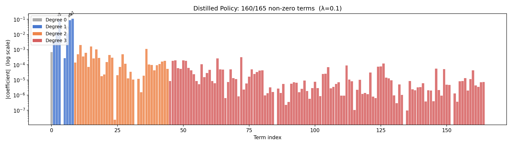

# Interpretable Control for Unstable Systems via SINDy-RL

**Patrick Smith · Andrew Falcone**  
ME 595 · University of Washington · Spring 2026

---

## Abstract

Safety-critical autonomous systems require controllers that can be formally verified, audited, and deployed on resource-constrained hardware — properties that large neural networks cannot satisfy. SINDy-RL [@zolman2025sindyrl] addresses this by co-training a polynomial surrogate and a neural policy in a Dyna loop, then distilling the result into a closed-form polynomial. We stress-test this pipeline on the inverted double pendulum (IDP) — a two-link system with two coupled unstable modes — asking whether it delivers its three core goals — data economy via the SINDy surrogate, a reduced-order policy via distillation, and interpretability via sparsity of the distilled controller. After resolving two non-obvious engineering obstacles (polynomial degree ceiling and surrogate exploitation), the Dyna loop declares convergence in six iterations using 39,616 counted real-environment steps — **10.1× fewer than a full-order PPO baseline** — with the in-loop iteration-6 policy achieving 60% task success under the main experiment's 500-step criterion. A separate post-hoc checkpoint scan found a stronger saved checkpoint labeled iteration 7, achieving 90% task success and mean episode length 904, but its generating run is not included in the 39,616-step accounting. Behavioral cloning of this stronger checkpoint into a degree-3 polynomial ($R^2 = 0.989$) preserves 90% closed-loop success, but achieves only minimal sparsification: STLSQ drops just 5 of 165 possible terms, leaving the polynomial near-dense. This is not a threshold-tuning problem — a sweep of the sparsity threshold confirms performance holds at 90--95% success as term count falls from 165 to 121, but the polynomial never approaches the compact, auditable form the method promises. The bottleneck is the polynomial feature basis itself, which is poorly conditioned: further zeroing risks eliminating structurally important contributions rather than numerical noise. A physics-informed variant exploiting IDP translational symmetry achieves comparable sparsity at reduced success (85%), confirming that the density is a property of this representation class on this system rather than an artifact of data volume or threshold choice.

## 1  Introduction

### 1.1  Motivation: The Inspectability Requirement

Deployed autonomous systems face a constraint that capable controllers must also be *inspectable*. Formal standards such as DO-178C (avionics software) and IEC 62443 (industrial control) require analyzable, auditable control laws [@arrieta2020xai; @rudin2019interpretable]; surgical robotics regulators may require that a control law be certifiable before permitting autonomous maneuvers near tissue; embedded actuators on spacecraft or small aerial vehicles have no floating-point stack capable of running a neural network at control rates. A ten-thousand-parameter neural network — however capable — offers no handle for stability proofs or formal verification, and its memory footprint alone disqualifies it from microcontroller deployment. A closed-form polynomial is the opposite: if sparse, each term has a physical interpretation; stability arguments can be constructed analytically, and a 165-term policy fits in kilobytes and evaluates as a single dot product.

This gap between what learning produces and what safety-critical systems can accept motivates a growing body of work on inherently interpretable controllers [@rudin2019interpretable] — models whose structure is transparent by construction, not approximated after the fact.

### 1.2  SINDy and the Data Problem for Unstable Systems

Sparse Identification of Nonlinear Dynamics (SINDy [@brunton2016sindy]) offers a principled path to interpretable governing equations. Given a library of candidate functions over the state and input, sparse regression identifies which terms actually drive the dynamics and discards the rest. The resulting model is compact, physically grounded, and composed of a small number of terms that a practitioner can read and reason about. The difficulty is data. For an unstable equilibrium — such as an inverted pendulum — a random policy crashes in a handful of steps, and the near-upright transitions that SINDy needs are entirely unvisited. The system cannot provide the training data without a controller it does not yet have.

The resolution is to co-train the dynamics model and the controller iteratively. Sutton's Dyna architecture [@sutton1990dyna] alternates between training a policy in a learned surrogate model and collecting new data from the real environment, so each iteration improves both components. Zolman et al. [@zolman2025sindyrl] apply this principle to SINDy by using an ensemble SINDy model as the Dyna surrogate, yielding SINDy-RL — a framework that bootstraps the data problem while retaining interpretability as a downstream option.

### 1.3  Goals and Contributions

We stress-test SINDy-RL against its three core goals — (1) data economy via the SINDy surrogate, (2) reduced-order policy via distillation, and (3) interpretability via sparsity of the distilled controller — on the inverted double pendulum (IDP), a demanding two-link benchmark with two coupled unstable modes and a narrow region of attraction. Our contributions are:

1. **Goal 1 — Data economy partially confirmed.** The Dyna loop reaches its convergence gate in six iterations using 39,616 counted real-environment steps — **10.1× fewer than a full-order PPO baseline** — with 60% in-loop task success under a 500-step criterion. A post-hoc checkpoint scan finds a stronger iteration-7 checkpoint at 90% success, but that checkpoint is not included in the 39,616-step accounting.
2. **Goal 2 — Reduced-order policy confirmed for the stronger checkpoint.** Behavioral cloning produces a 160-term degree-3 polynomial that is **59× smaller** than the baseline NN (160 terms vs. 9,731 parameters) and preserves 90% closed-loop success for the post-hoc iteration-7 teacher — compatible with embedded hardware deployment, but separate from the six-iteration step count.
3. **Goal 3 — Interpretability not achieved.** STLSQ retains 160 of 165 terms; a 160-term polynomial is not a readable policy. A threshold sweep confirms this is not a tuning problem — term count falls only from 165 to 121 while preserving performance, never approaching an interpretable form.
4. **Root cause of residual density.** The polynomial feature matrix is ill-conditioned ($\kappa \approx 2.4 \times 10^4$), preventing STLSQ from zeroing additional terms without risking structural contributions — a representation issue, not a data-volume problem.
5. Diagnosis and resolution of two non-obvious engineering obstacles (polynomial degree ceiling and surrogate exploitation) with practical safeguards applicable to other unstable benchmark systems.

### 1.4  Ethics and Safety Considerations

**Benefits.** Interpretable controllers have direct safety benefits: closed-form polynomial expressions can be analyzed for failure modes before deployment, admit Lyapunov-style stability certificates in certain regimes, and allow human engineers to audit the control law. SINDy-RL's data efficiency reduces wear and risk on real hardware during training — fewer physical interactions means fewer dangerous exploration failures. Compact controllers enable deployment on hardware that cannot run large neural networks, potentially bringing safe autonomous control to resource-constrained applications in healthcare, agriculture, and infrastructure.

**Risks.** Surrogate exploitation — where a policy finds action sequences that the polynomial model predicts as highly rewarding but that do not correspond to real physics — is a failure mode that can produce overconfident deployment decisions. A practitioner who observes high surrogate reward without validating on the real environment may incorrectly conclude the system is ready for deployment. Incomplete sparsity (our 165-term result is compact but not truly auditable in the way a five-term equation would be) creates a risk that the "interpretability" framing overstates what an engineer can actually verify. Finally, distribution shift between the training distribution and deployment conditions can cause polynomial controllers to fail catastrophically in states not covered by the training data — a risk that perturbation augmentation mitigates but does not eliminate.

Any deployment of a SINDy-RL-derived controller in a safety-critical application should include real-hardware validation across the full intended operating envelope, formal analysis of the polynomial's behavior at boundary conditions, and a fallback mechanism (e.g., a conservative linear controller) for states outside the validated region.

---

## 2  Technical Background

### 2.1  The Testbed: Inverted Double Pendulum

\begin{wrapfigure}{r}{0.25\linewidth}
  \vspace{-48pt}
  \centering
  \includegraphics[width=\linewidth]{figures/pendulum_diagram.png}
  \captionsetup{font=scriptsize, labelfont=bf}
  \caption*{\textbf{Figure 1.} IDP geometry. State $\mathbf{x} = [x, \theta_1, \theta_2, \dot{x}, \dot{\theta}_1, \dot{\theta}_2]$. Tip height $h \in [0,\, 1.2]$ m; episode ends at $h \leq 1.0$ m.}
  \vspace{-6pt}
\end{wrapfigure}

The `InvertedDoublePendulum-v5` environment (MuJoCo 3.8.1 / Gymnasium 1.2.3) consists of two rigid links of equal length $L_1 = L_2 = 0.6$ m mounted on a sliding cart. The physical state is $\mathbf{x} = [x,\theta_1,\theta_2,\dot{x},\dot{\theta}_1,\dot{\theta}_2] \in \mathbb{R}^6$, where $x$ is the cart's horizontal position along the track, $\theta_1, \theta_2$ are joint angles measured from vertical, and dots denote time derivatives. The 9-dimensional observation replaces raw angles with sine/cosine encodings to avoid wrapping discontinuities. The single control input is a horizontal cart force $u \in [-1, 1]$.

Tip height $h = L_1\cos\theta_1 + L_2\cos(\theta_1+\theta_2)$ reaches a maximum of 1.2 m when both poles are vertical. Gymnasium terminates an episode when $h \leq 1.0$ m, leaving only a 0.2 m near-upright band between success and failure. The per-step reward is:

$$r_k = 10\cdot\mathbf{1} - (h_k-2)^2 - 0.01\,x_\text{tip}^2 - \varepsilon\|\dot{\boldsymbol{\theta}}\|^2$$

where the alive bonus (first term, $\approx10$/step) dominates when the system remains upright. Episodes are capped at 1,000 steps (50 s at $\Delta t = 0.05$ s).

### 2.2  SINDy-C: Sparse Dynamics Identification with Control

SINDy [@brunton2016sindy] identifies discrete-time dynamics by regressing the state increment against a polynomial library:

$$\mathbf{x}_{k+1} - \mathbf{x}_k = \underbrace{\Theta(\mathbf{x}_k,\, u_k)}_{\text{library}} \cdot \underbrace{\Xi}_{\text{sparse coefficients}}$$

For control-affine systems (SINDy-C [@kaiser2018sindympc]), the input $u_k$ is included directly in the library.[^ca] The Sequentially Thresholded Least Squares (STLSQ) algorithm zeros coefficients below threshold $\lambda$, promoting sparsity in $\Xi$. A degree-$d$ library over $n$ variables contains $\binom{n+d}{d}$ terms; for the IDP's 7-dimensional state-action vector, degree-2 gives 36 features and degree-3 gives 120, a distinction that proved critical to convergence (§4.2).

[^ca]: A system is control-affine if the control input appears linearly in the dynamics: $\dot{\mathbf{x}} = f(\mathbf{x}) + g(\mathbf{x})\,u$, where $f$ and $g$ may be arbitrarily nonlinear in the state. Most mechanical systems driven by forces or torques, including the IDP, satisfy this property.

### 2.3  E-SINDy: Ensemble Uncertainty Quantification

A single SINDy model provides a point estimate with no uncertainty information. Fasel et al. [@fasel2022esindy] address this with Ensemble SINDy (E-SINDy): fit $M$ independent SINDy models on 80% bootstrap subsamples of the data, then at inference time report the mean and standard deviation of predictions across the ensemble. For $M = 10$ models, at each surrogate step `predict(x, u)` returns $(\mu_\Delta, \sigma_\Delta)$, where $\mu_\Delta$ is the ensemble-mean predicted state increment and $\sigma_\Delta$ is the per-component standard deviation across members. High $\sigma_\Delta$ signals extrapolation beyond the training distribution. Following Zolman et al. §3.5 [@zolman2025sindyrl], we convert this into an active penalty: surrogate reward is reduced by $\kappa\cdot\text{mean}(\sigma_\Delta)$ per step ($\kappa = 5.0$), steering PPO away from high-uncertainty states.

### 2.4  Dyna-Style Model-Based RL and Behavioral Cloning

The Dyna architecture [@sutton1990dyna] alternates cheap model-based rollouts inside a learned surrogate with real-environment data collection. In SINDy-RL [@zolman2025sindyrl], the surrogate is the E-SINDy ensemble and the planner is PPO [@schulman2017ppo]. Figure 2 shows the RL control loop; in SINDy-RL the environment is instantiated twice: as the E-SINDy surrogate for cheap policy training, and as real MuJoCo for data collection and evaluation.

{width=82%}

A Schroeder multi-sine sweep [@schroeder1970] bootstraps the initial dataset $\mathcal{D}$. Each Dyna iteration refits E-SINDy on near-upright transitions, runs PPO for 100k surrogate steps (warm-started from the prior policy), then collects 4,000 real transitions. After convergence, a selected teacher checkpoint is distilled via behavioral cloning:

$$\min_{\Xi}\;\bigl\|\Theta_\text{obs}(X)\,\Xi - U^*\bigr\|_2 \quad \text{(STLSQ, } \lambda=0.10\text{)}$$

where $X$ is a matrix of observations, $U^*$ are the corresponding NN policy actions, and $\Theta_\text{obs}$ is the degree-3 polynomial library over the 8-dimensional sin/cos observation. Perturbation augmentation [@ross2011dagger] (adding Gaussian noise to expert states and re-querying the trained neural network policy, referred to as the NN oracle) expands the 50k-transition dataset 5× to mitigate distribution shift without additional simulator rollouts.

![**Figure 3.** Sparse regression structure for E-SINDy dynamics identification (*left*) and policy distillation (*right*). Each of the $k = 1,\ldots,M$ ensemble members solves $\Delta\mathbf{X}^k = \Theta_\text{dyn}^k \Xi_\text{dyn}^k$, where $\Theta_\text{dyn}^k \in \mathbb{R}^{N \times 120}$ is the degree-3 polynomial library over the 7-dimensional state-action input evaluated on a bootstrap subsample, and $\Xi_\text{dyn}^k \in \mathbb{R}^{120 \times 6}$ (orange) is the fitted coefficient matrix. Distillation fits a single $U = \Theta_\pi \Xi_\pi$, where $\Theta_\pi \in \mathbb{R}^{N \times 165}$ is the degree-3 library over the 8-dimensional sin/cos observation, and $\Xi_\pi \in \mathbb{R}^{165 \times 1}$ (purple) is the scalar action coefficient vector. The two libraries are distinct: different input spaces (raw state-action vs. sin/cos encoding) and different feature counts (120 vs. 165). Annotations below each $\Xi$ give the nonzero coefficient count after STLSQ thresholding — 690 of 720 possible entries for the dynamics model and 160 of 165 for the distilled policy — indicating that both fits are near-dense.](figures/sindy_matrix_shapes.svg){width=90%}

---

## 3  Methods

The evaluation has three components. First, a full-order PPO agent trained with unlimited simulator access establishes the performance ceiling. Second, the SINDy-RL Dyna pipeline co-trains an E-SINDy surrogate and a PPO policy using a fraction of those real interactions, targeting comparable task success. Third, behavioral cloning — fitting a sparse polynomial to imitate the neural policy's actions, a process we refer to as *distillation* — converts the result into a closed-form expression suitable for embedded deployment and formal analysis. All three are implemented on the IDP testbed (§2.1).

### 3.1  Baseline: Full-Order PPO

The performance ceiling is a standard PPO agent (Stable-Baselines3 2.8.0) trained with unlimited real-environment access: a two-hidden-layer [64,64] MLP with tanh activations (9,731 parameters), trained for 400,000 total steps across 15,103 episodes. This agent is evaluated only as a reference point; the Dyna loop produces its own neural policy, and it is that policy — not the baseline — that is subsequently distilled into a polynomial.

### 3.2  SINDy-RL Pipeline

All code is implemented in Python 3.12.7 using PySINDy 2.1.0 [@desilva2020pysindy] (E-SINDy surrogate), Stable-Baselines3 2.8.0 [@raffin2021sb3] (PPO policy), Gymnasium 1.2.3 with MuJoCo 3.8.1 [@todorov2012mujoco] (simulation environment), NumPy 2.4.6 (numerical operations), and scikit-learn 1.8.0 (polynomial feature generation). The full pipeline is in `notebooks/sindy-rl.ipynb`.

**Bootstrap (Stage 1).** 300 episodes of Schroeder multi-sine excitation collect 2,897 near-upright state-transition pairs from real MuJoCo.

**E-SINDy fit (Stage 2).** Transitions with tip height $h > 1.10$ m (poles within $\approx 24°$ of vertical) are retained.[^filter] Ten degree-3 SINDy-C models (PySINDy `SINDy` with `PolynomialLibrary(degree=3)` and `STLSQ(threshold=0.05)`) are fit on 80% bootstrap subsamples. Their coefficient matrices are stacked into a `FastEnsemblePredictor`[^fep] for efficient surrogate stepping.

**Surrogate PPO (Stage 3).** The predictor is wrapped in `EnsembleSurrogateEnv`[^surenv], a Gymnasium environment that replicates MuJoCo's reward formula and $h \leq 1.0$ m termination condition, adds the uncertainty penalty $\kappa \cdot \text{mean}(\sigma_\Delta)$, and enforces physical state bounds ($|x|\leq2.5$ m, $|\theta|\leq0.9$ rad, $|\dot{\theta}|\leq12$ rad/s). PPO trains for 100k steps; early-stopped if mean surrogate episode length stays below 5 steps after 50k steps.

**Real data collection (Stage 4).** The policy is deployed in real MuJoCo for 4,000 steps, appended to $\mathcal{D}$.

**Repeat with warm-start (Stage 5).** If exploitation is detected (surrogate reward $> 3\times$ previous AND real episode length $< 50\%$ of best seen), the next iteration rolls back to the best real-env checkpoint.

**Distillation.** 50k expert transitions are collected from the selected post-hoc teacher checkpoint in real MuJoCo, augmented 5× with per-dimension Gaussian noise ($\sigma$: [0.02, 0.02, 0.02, 0.05, 0.10, 0.10] for $[x, \theta_1, \theta_2, \dot{x}, \dot\theta_1, \dot\theta_2]$), and re-queried from the NN oracle. A degree-3 polynomial is then fit via STLSQ ($\lambda = 0.10$) on the 8-dimensional sin/cos observation.

[^filter]: The initial value was inherited from a reward-shaping constant `TIP_HEIGHT_TARGET = 2.0` (a dimensionless offset in MuJoCo's reward formula, not a physical height), setting `SINDY_H_MIN = 1.6` m — above the physical maximum $L_1 + L_2 = 1.2$ m. Every iteration silently fell back to fitting on all collected data until corrected to `SINDY_H_MIN = 1.10` m, derived from segment geometry.

[^fep]: The bottleneck was `PolynomialLibrary.transform()` from scikit-learn, which carries ~1 ms fixed overhead per call regardless of input size; calling it once per ensemble member cost ~10 ms/step and ~13 min per 75k-step PPO phase. The fix: at construction, extract the `powers_` exponent matrix from sklearn's `PolynomialFeatures` once; at each step, compute features as `np.prod(xu ** powers_, axis=1)` in pure NumPy and apply all 10 pre-stacked `(10, 6, 120)` coefficient matrices via a single batched matmul (~0.93 ms/step, 11.5× speedup).

[^surenv]: Gymnasium wrapper around the E-SINDy ensemble: reward = MuJoCo formula (§2.1) minus $\kappa\cdot\text{mean}(\sigma_\Delta)$; termination at $h\leq1.0$ m or outside physical limits with a $-50$ out-of-bounds penalty. Matching MuJoCo's conditions exactly is necessary for policy transfer.

### 3.3  Metrics

Data efficiency is measured by real-environment step count. Task performance is measured by success rate (episodes lasting at least 500 steps) and mean episode length. Surrogate quality is tracked by E-SINDy one-step RMSE on held-out near-upright transitions. Distillation quality is measured by OLS $R^2$ and STLSQ term count.

---

## 4  Results

### 4.1  Baseline

Full-order PPO achieves mean reward $9{,}324 \pm 2$, 100% success, and mean episode length 1,000/1,000 steps at a cost of 400,000 real simulator interactions and a 9,731-parameter opaque network. This is the performance ceiling.

### 4.2  Dyna Loop Convergence

The Dyna loop declared convergence at iteration 6 using 39,616 counted real steps, **10.1× fewer than the baseline**. Figure 4 shows episode length distributions for selected checkpoints. The in-loop iteration-6 evaluation reached 60% success under the 500-step criterion and mean episode length 616. A separate checkpoint scan identified a saved checkpoint labeled iteration 7 with 90% success and mean episode length 904, but that scan is not part of the 39,616-step convergence accounting. The converged E-SINDy dynamics model is dense: 690 out of 720 possible coefficients (120 features × 6 state dimensions) are nonzero, indicating that this polynomial basis and STLSQ setting produced a near-dense model.

![**Figure 4.** Episode length distributions for the baseline PPO and selected SINDy-RL checkpoints, evaluated over 20 episodes each. Success rate ($\geq$ 500 steps) is annotated above each box. Iteration 7 (starred) is the best checkpoint in the post-hoc scan, not part of the stopped iteration-6 real-step accounting. Its successful episodes are capped at 1000 steps and collapse onto the dashed green max line; the low visible marker(s) are the failed episodes. Iterations 10 and 20 illustrate the performance collapse following peak convergence — a consequence of continued surrogate exploitation that degrades the dataset.](figures/fig_ep_lengths.png){width=90%}

| Iteration | Cumul. real steps | SINDy RMSE | Surr. mean len | Real mean len | Success |
|-----------|------------------|------------|----------------|---------------|---------|
| Bootstrap | 2,897 | 0.016 | — | — | — |
| 1 | 7,015 | 0.016 | 11.8 | 12 | 0% |
| 2 | 11,186 | 0.020 | 17.1 | 17 | 0% |
| 3 | 15,551 | 0.084 | 36.5 | 36 | 0% |
| 4 | 19,979 | 0.095 | 42.8 | 43 | 0% |
| 5 | 29,453 | 0.085 | 547 | 547 | 50% |
| **6** | **39,616** | **0.080** | **616** | **616** | **60%** |

| Post-hoc checkpoint scan | Eval episodes | Real mean len | Success (≥500 steps) |
|---|---:|---:|---:|
| **7** | 20 | 904 | 90% |

The 39,616-step count applies to the stopped iteration-6 Dyna run. The iteration-7 checkpoint is useful as a post-hoc performance diagnostic, but it should not be credited with the same real-environment budget unless its generating run is reconstructed and counted separately. The RMSE rise at iterations 3--4 reflects a better policy exploring states further from vertical, not model degradation; the surrogate remained accurate in the near-upright band.

**Strict full-horizon stress test.** To test whether the surrogate-trained PPO policy could match the baseline rather than merely reach the report's 500-step success criterion, we ran a stricter continuation experiment requiring all evaluation episodes to survive the full 999-step horizon. This is a harder metric than the 90% result reported above, not a direct repetition of the same success definition. The stricter loop used larger real-data corrections (6,000 transitions/iteration), 150k surrogate PPO steps/iteration, fixed seed-block evaluation, targeted failed-seed replay, and rollback on real-performance regression. This did not close the remaining gap. The best surrogate-only checkpoint reached **80% full-horizon success** and mean episode length 805 at iteration 12 after **108,251 counted real MuJoCo interactions**; continuing to 20 iterations consumed **270,142 interactions** without exceeding that peak, with later checkpoints oscillating between 40--80% success. A preliminary real-PPO fine-tune initialized from the best surrogate checkpoint added 57,344 real training steps and still evaluated at only **77% full-horizon success** on the 30-seed final evaluation. We therefore treat the original Dyna result as a data-efficient partial-success controller, not as a baseline-matching controller. This negative result is consistent with the failure mode emphasized by Zolman et al. [@zolman2025sindyrl]: Dyna-style SINDy-RL can be highly sample-efficient, but the neural policy may overfit or drift when the surrogate no longer captures the rollout distribution tightly enough.

### 4.3  Engineering Obstacles

Two non-obvious obstacles prevented convergence on early attempts.

**Degree-2 RMSE ceiling.** Over 25 iterations with data growing from 5k to 90k transitions, RMSE oscillated at 0.10--0.16 and real episode length grew from only 6 to 22 steps. A degree-2 library (36 features) cannot express the inter-modal coupling terms that dominate IDP dynamics (e.g., $\cos\theta_1 \cdot \cos\theta_2 \cdot \dot\theta_1$), which are cubic. When RMSE fails to decrease with 10× more data, the cause is model capacity, not data quantity. Fix: `SINDY_DEGREE=3` (120 features), which dropped RMSE to 0.013 within two iterations.

**Surrogate exploitation.** In a diagnostic run, surrogate reward jumped 9× (497 to 4,525) while real episode length collapsed 87% (414 to 56 steps). The policy found action sequences the polynomial predicted as highly rewarding that had no correspondence to real physics. Uncertainty penalization alone is insufficient: all 10 ensemble members share the same polynomial basis, so in extrapolated regions they all make the same wrong prediction simultaneously and ensemble disagreement $\sigma_\Delta$ remains low. Rollback alone is also insufficient: it detects exploitation after the fact but does not prevent the exploited iteration from degrading the dataset. Fix: both mechanisms together — uncertainty penalty `reward -= 5.0 * mean(sigma_delta)` during surrogate PPO, plus rollback to best real-env checkpoint when surrogate reward exceeds 3× the previous value and real episode length drops below 50% of best seen. The design principle generalizes: any ensemble surrogate built on a shared function basis cannot detect shared extrapolation errors through internal disagreement — real-environment feedback is the only reliable out-of-distribution signal.

### 4.4  Policy Distillation

Behavioral cloning from the selected post-hoc teacher checkpoint (iteration 7, 90% success) produced a degree-3 polynomial with $R^2 = 0.9894$. Three additional obstacles required resolution: (1) the distillation teacher must be the selected checkpoint policy, not the final loop policy, which may have drifted during surrogate training (using the final policy gave 0% success); (2) degree-2 gave $R^2 \approx 0.905$ regardless of data volume, requiring degree-3; (3) perturbation augmentation was needed to close distribution shift between the NN's training trajectories and deployment states.

STLSQ at $\lambda = 0.10$ dropped five terms, retaining **160/165 terms** with **90% closed-loop success** — identical to the teacher (Figure 5). The distilled policy is 59× smaller than the baseline NN. Figure 6 shows a threshold sweep across $\lambda \in [0.001, 1.0]$: success remains at 90--95% while term count drops from 165 to 121, confirming that distillation performance is robust to the threshold choice. The dominant policy terms include recognizable physical structure: a constant bias; proportional angle feedback on $\cos\theta_1$ and $\cos\theta_2$; velocity damping on $\dot\theta_1$ and $\dot\theta_2$; and a large inter-pole coupling term ($\cos\theta_1 \times \cos\theta_2$) — the physically expected dominant nonlinearity. The remaining cubic cross-terms encode residual nonlinearity from the NN's tanh activations.

{width=90%}

{width=82%}

The dynamics feature matrix $\Theta$ (209,620 × 120) has condition number $\kappa = 2.37 \times 10^4$ (full rank, 120/120 singular values nonzero). Ill-conditioning worsens with output dimension: $\kappa = 3.18 \times 10^2$ for the $x$-position equation (40 active OLS features) rising to $\kappa = 2.30 \times 10^4$ for $\dot\theta_2$ (116 active features). In an ill-conditioned feature basis, small OLS coefficients along low-singular-value directions are numerically unreliable; STLSQ cannot safely threshold the remaining 160 terms without risking structural contributions. The 690/720 nonzero dynamics coefficients reflect the same phenomenon — not that all terms are mechanistically necessary, but that the feature basis does not admit a stable sparse decomposition. As on other unstable systems, $R^2 = 0.9894$ on the distillation set is a necessary but not sufficient metric: small in-distribution approximation errors can compound against the IDP's unstable modes in closed loop.

Distillation preserves neural-policy performance while delivering a closed-form controller compatible with embedded hardware deployment (Goal 2, achieved). Formal verification and regulatory auditability depend on sparsity (Goal 3), which was not achieved on this system.

| Approach | Real-env steps | Mean ep len | Success (≥500 steps) | Params |
|---|---|---|---|---|
| Baseline PPO | 400,000 | 1,000 | 100% | 9,731 |
| SINDy-RL NN (Dyna convergence) | 39,616 | 616 | 60% | 9,731 |
| SINDy-RL NN (post-hoc checkpoint scan) | not reconstructed | 904 | 90% | 9,731 |
| SINDy-RL Polynomial (post-hoc teacher) | not reconstructed + 50,000$^\dagger$ | 904 | 90% | 160 terms |

$^\dagger$50,000 rollout steps for distillation data; 5× perturbation augmentation reuses the NN oracle without additional MuJoCo interactions. The real-step count for the post-hoc iteration-7 teacher is not reconstructed in the stopped six-iteration Dyna history.

### 4.5  Physics-Informed Feature Reduction via Translational Symmetry

The IDP equations of motion are invariant under cart translations $x \to x + c$: the Lagrangian contains $\dot{x}$ but not $x$, so the state increment $\Delta x = \dot{x}\,\Delta t$ is given exactly by kinematics and need not be learned. Removing $x$ from the SINDy library reduces the state-action input from 7 to 6 dimensions and cuts the degree-3 feature count from $\binom{10}{3} = 120$ to $\binom{9}{3} = 84$ — a 30% reduction — while hard-coding $\Delta x = \dot{x}\cdot\Delta t$ in the surrogate step. The distillation library is unchanged (it operates on the 8-dimensional sin/cos observation, which retains $x$ via the position-dependent reward).

With the reduced library the Dyna loop converges in seven iterations using approximately 31,000 real-environment steps. The converged neural policy achieves **85% task success and mean episode length 856 steps**. Behavioral cloning yields $R^2 = 0.9987$ and **162/165 terms** at $\lambda = 0.05$, comparable to the standard formulation's 160/165 at $\lambda = 0.10$, but at 5 percentage points lower neural-policy success (85% vs. 90%). The no-$x$ variant does not outperform the standard formulation: both achieve comparable distillation sparsity while the standard formulation achieves higher task success. This suggests the degree-3 polynomial basis already captures the translational symmetry implicitly through the relationship between $x$, $\dot{x}$, and the dynamics, making the explicit coordinate removal redundant. We also examined SE(3) forward-kinematics coordinates (replacing raw angles with absolute-link sin/cos), which produced catastrophic ill-conditioning ($\kappa = 10^{17}$--$10^{19}$) due to unit-circle constraints ($\sin^2\theta + \cos^2\theta = 1$) creating near-exact linear dependence in the degree-2+ polynomial features — confirming that the choice of coordinate representation has a larger effect on numerical stability than on task performance, and that degree-3 in raw angles is difficult to improve upon at this data scale.

\newpage

### 4.6  Code Repository

All code and results: **https://github.com/falconeaj1/ME_595**. Key notebooks: `full-order-simulation.ipynb` (baseline PPO), `sindy-rl.ipynb` (SINDy-RL pipeline), and `sindy-rl-no-x.ipynb` (translational-symmetry variant). Professor Michelle Hickner added as collaborator (GitHub: mhickner).

---

## 5  Summary

We stress-tested SINDy-RL against its three core goals on the inverted double pendulum. **Goal 1 (data economy) is partially confirmed**: the Dyna loop reaches its convergence gate using 39,616 counted real-environment steps — 10.1× fewer than the full-order PPO baseline — but the in-loop policy is a 60%-success controller under the 500-step criterion, not the 90%-success checkpoint found later in a post-hoc scan. **Goal 2 (reduced-order policy) is achieved for the stronger checkpoint**: behavioral cloning produces a polynomial controller that is 59× smaller than the baseline NN (160 terms vs. 9,731 parameters) and preserves 90% closed-loop success for the post-hoc iteration-7 teacher — compact, fast, and compatible with embedded hardware deployment, but not part of the 39,616-step accounting. **Goal 3 (interpretability) not achieved**: 160 of 165 terms survive STLSQ, and a threshold sweep confirms this cannot be tuned away (90--95% success, 121--165 terms over the stable range of $\lambda$). A 160-term polynomial evaluates as a single dot product but is not auditable in the way a five-term equation would be. The residual density is explained by ill-conditioning of the degree-3 feature matrix ($\kappa \approx 2.4 \times 10^4$) — a representation issue that neither more data nor aggressive thresholding can resolve.

Reaching the data-efficiency result required resolving two non-obvious engineering obstacles absent from Zolman et al.'s algorithm description: the degree-2 RMSE ceiling showed that the IDP requires a cubic polynomial library (120 features vs. 36); and surrogate exploitation showed that uncertainty penalization and rollback are complementary safeguards — neither is sufficient alone.

A physics-informed variant dropping cart position from the SINDy library (exploiting translational symmetry) achieves comparable distillation sparsity (162/165 at $\lambda = 0.05$) but at 5 percentage points lower neural-policy success (85% vs. 90%). The standard degree-3 library already captures the translational structure implicitly, suggesting that additional coordinate engineering is unlikely to be the path to true sparsity on this system.

Several open questions remain. First, the strict full-horizon continuation experiment suggests that simply extending the Dyna loop is not enough to match the baseline: the best surrogate-only checkpoint reached 80% full-horizon success at 108k real interactions, and additional Dyna plus preliminary real PPO fine-tuning still failed to reach the baseline's 100% success. Matching the baseline likely requires a different model class or stronger physics prior, not just more iterations. Second, physics-informed libraries derived from the Euler-Lagrange equations — using gravity terms, mass-matrix coupling, and Coriolis interactions as basis functions rather than generic polynomial monomials — may achieve true sparsity by encoding the system's structure directly; preliminary library comparisons show 35× better conditioning ($\kappa \approx 3\times10^4$) with only 32 features versus the degree-3 polynomial's 120, and a full Dyna comparison is ongoing. Third, the distillation process requires real-environment data collection despite the theoretical justification for querying the policy at any state [@zolman2025sindyrl]: "because there is no temporal dependence on $\pi_\phi$, we can assemble our data and label pairs by evaluating $\pi_\phi$ for any $\mathbf{x}$" — it is unclear why surrogate trajectories alone are insufficient for distillation, and this bears further investigation.

\newpage

\noindent\textbf{CRediT Statement} (\url{https://credit.niso.org})

\begingroup
\small
\begin{tabular}{lll}
\textbf{Role} & \textbf{Patrick Smith} & \textbf{Andrew Falcone} \\
\hline
Conceptualization          & Yes  & Yes        \\
Data curation              & Yes  & Yes        \\
Formal analysis            & Lead & Supporting \\
Investigation              & Yes  & Yes        \\
Methodology                & Lead & Supporting \\
Software                   & Lead & Supporting \\
Validation                 & Yes  & Yes        \\
Visualization              & Yes  & Yes        \\
Writing -- original draft  & Yes  & Yes        \\
Writing -- review \& editing & Yes & Yes       \\
\end{tabular}
\endgroup

\smallskip
\noindent\small\textit{AI tool disclosure: Claude (Anthropic) assisted with code drafting, debugging, writing iteration, and figure generation. All analysis, results, and conclusions were reviewed and executed by the authors, who take full responsibility for the submitted work.}

\newpage

# References
