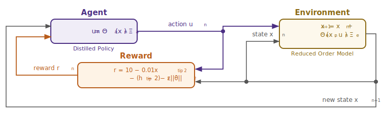

# Interpretable Control for Unstable Systems via SINDy-RL

**Patrick Smith · Andrew Falcone**  
ME 595 · University of Washington · Spring 2026

---

## Abstract

Safety-critical autonomous systems increasingly require controllers that can be formally verified, audited, and deployed on resource-constrained hardware — properties that large neural networks cannot satisfy. Sparse Identification of Nonlinear Dynamics (SINDy) can produce closed-form polynomial controllers that meet these requirements, but unstable systems cannot generate the near-equilibrium data SINDy needs without a stabilizing controller that does not yet exist. SINDy-RL (Zolman et al., 2024) resolves this chicken-and-egg problem with a Dyna-style loop that co-trains an Ensemble SINDy (E-SINDy) surrogate and a Proximal Policy Optimization (PPO) neural policy. We implement Algorithm 1 from Zolman et al. on the inverted double pendulum (IDP) — a two-link system with two coupled unstable modes — and identify three non-obvious engineering obstacles (polynomial degree ceiling, filter geometry bug, surrogate exploitation) that prevented early convergence. After resolving these, the Dyna loop converges in four iterations using 27,512 real-environment steps, 14.5× fewer than a full-order PPO baseline. The converged neural policy is distilled into a 165-term degree-3 polynomial achieving 65% task success, a controller 59× smaller than the baseline network. Our results confirm that SINDy-RL substantially reduces real-environment data requirements and produces compact controllers suited to safety-critical deployment, while identifying open questions about distillation data requirements and polynomial sparsity on strongly coupled systems.

---

## 1  Introduction

### 1.1  Motivation: The Interpretability Gap in Autonomous Control

The proliferation of deep reinforcement learning (RL) in autonomous systems has produced controllers of remarkable capability, but capability alone is insufficient for safety-critical deployment. Regulators increasingly require that algorithmic decisions be explainable and auditable [8, 9], and formal standards such as DO-178C (avionics) and IEC 62443 (industrial control) require analyzable control laws. A nine-thousand-parameter neural network offers no handle for stability proofs or formal verification; its memory and compute footprint make it unsuitable for microcontroller execution. If the controller is instead a closed-form polynomial equation, each term can be audited by an engineer, bounding arguments can be constructed analytically, and the policy fits in kilobytes — evaluation requires only a dot product. This representational gap between what deep RL produces and what deployed systems can accept motivates a growing body of work on inherently interpretable models [9]: controllers whose structure is transparent by construction, not explained after the fact.

Real-world motivating applications include surgical robotics, where regulators may require that a control law be inspectable before a device can perform autonomous maneuvers near tissue; autonomous systems operating in the vicinity of humans, where a failure mode must be demonstrably bounded; and embedded actuators on spacecraft or small aerial vehicles where there is no floating-point stack capable of running a neural network at control rates.

### 1.2  SINDy and the Data Problem for Unstable Systems

Sparse Identification of Nonlinear Dynamics (SINDy [2]) offers a principled path to interpretable governing equations. Given a library of candidate functions over the state and input, sparse regression identifies which terms actually drive the dynamics and discards the rest. The resulting model is compact, physically grounded, and composed of a small number of terms that a practitioner can read and reason about. The difficulty is data. For an unstable equilibrium — such as an inverted pendulum — a random policy crashes in a handful of steps, and the near-upright transitions that SINDy needs are entirely unvisited. The system cannot provide the training data without a controller it does not yet have.

The resolution is to co-train the dynamics model and the controller iteratively. Sutton's Dyna architecture [6] alternates between training a policy in a learned surrogate model and collecting new data from the real environment, so each iteration improves both components. Zolman et al. [1] apply this principle to SINDy by using an ensemble SINDy model as the Dyna surrogate, yielding SINDy-RL — a framework that bootstraps the data problem while retaining interpretability as a downstream option.

### 1.3  Goals and Contributions

We implement Algorithm 1 from Zolman et al. [1] on the inverted double pendulum (IDP), a demanding two-link benchmark with two coupled unstable modes and a narrow region of attraction. Our contributions are:

1. A working SINDy-RL implementation on the IDP that converges in four Dyna iterations using 27,512 real-environment steps — **14.5× fewer than a full-order PPO baseline** trained to 100% success.
2. A degree-3 polynomial controller distilled from the converged policy, achieving 65% task success and **59× smaller** than the baseline network.
3. Diagnosis and resolution of three non-obvious engineering obstacles (polynomial degree ceiling, filter geometry bug, surrogate exploitation) with practical safeguards applicable to other unstable benchmark systems.

### 1.4  Ethics and Safety Considerations

**Benefits.** Interpretable controllers have direct safety benefits: closed-form polynomial expressions can be analyzed for failure modes before deployment, admit Lyapunov-style stability certificates in certain regimes, and allow human engineers to audit the control law. SINDy-RL's data efficiency reduces wear and risk on real hardware during training — fewer physical interactions means fewer dangerous exploration failures. Compact controllers enable deployment on hardware that cannot run large neural networks, potentially bringing safe autonomous control to resource-constrained applications in healthcare, agriculture, and infrastructure.

**Risks.** Surrogate exploitation — where a policy finds action sequences that the polynomial model predicts as highly rewarding but that do not correspond to real physics — is a failure mode that can produce overconfident deployment decisions. A practitioner who observes high surrogate reward without validating on the real environment may incorrectly conclude the system is ready for deployment. Incomplete sparsity (our 165-term result is compact but not truly auditable in the way a five-term equation would be) creates a risk that the "interpretability" framing overstates what an engineer can actually verify. Finally, distribution shift between the training distribution and deployment conditions can cause polynomial controllers to fail catastrophically in states not covered by the training data — a risk that perturbation augmentation mitigates but does not eliminate.

Any deployment of a SINDy-RL-derived controller in a safety-critical application should include real-hardware validation across the full intended operating envelope, formal analysis of the polynomial's behavior at boundary conditions, and a fallback mechanism (e.g., a conservative linear controller) for states outside the validated region.

---

## 2  Technical Background

### 2.1  The Testbed: Inverted Double Pendulum

\begin{wrapfigure}{r}{0.25\linewidth}
  \vspace{-48pt}
  \centering
  \includegraphics[width=\linewidth]{figures/pendulum_diagram.png}
  \captionsetup{font=scriptsize, labelfont=bf}
  \caption*{\textbf{Figure 1.} IDP geometry. State $\mathbf{x} = [x, \theta_1, \theta_2, \dot{x}, \dot{\theta}_1, \dot{\theta}_2]$. Tip height $h \in [0,\, 1.2]$ m; episode ends at $h \leq 1.0$ m.}
  \vspace{-6pt}
\end{wrapfigure}

The `InvertedDoublePendulum-v5` environment (MuJoCo 3.8.1 / Gymnasium 1.2.3) consists of two rigid links of equal length $L_1 = L_2 = 0.6$ m mounted on a sliding cart. The physical state is $\mathbf{x} = [x,\theta_1,\theta_2,\dot{x},\dot{\theta}_1,\dot{\theta}_2] \in \mathbb{R}^6$, where $\theta_1, \theta_2$ are joint angles measured from vertical. The 9-dimensional observation replaces raw angles with sine/cosine encodings to avoid wrapping discontinuities. The single control input is a horizontal cart force $u \in [-1, 1]$.

Tip height $h = L_1\cos\theta_1 + L_2\cos(\theta_1+\theta_2)$ reaches a maximum of 1.2 m when both poles are vertical. Gymnasium terminates an episode when $h \leq 1.0$ m, leaving only a 0.2 m near-upright band between success and failure. The per-step reward is:

$$r_k = 10\cdot\mathbf{1} - (h_k-2)^2 - 0.01\,x_\text{tip}^2 - \varepsilon\|\dot{\boldsymbol{\theta}}\|^2$$

where the alive bonus (first term, $\approx10$/step) dominates when the system remains upright. Episodes are capped at 1,000 steps (50 s at $\Delta t = 0.05$ s).

### 2.2  SINDy-C: Sparse Dynamics Identification with Control

SINDy [2] identifies discrete-time dynamics by regressing the state increment against a polynomial library:

$$\mathbf{x}_{k+1} - \mathbf{x}_k = \underbrace{\Theta(\mathbf{x}_k,\, u_k)}_{\text{library}} \cdot \underbrace{\Xi}_{\text{sparse coefficients}}$$

For control-affine systems (SINDy-C [3]), the input $u_k$ is included directly in the library.[^ca] The Sequentially Thresholded Least Squares (STLSQ) algorithm zeros coefficients below threshold $\lambda$, promoting sparsity in $\Xi$. A degree-$d$ library over $n$ variables contains $\binom{n+d}{d}$ terms; for the IDP's 7-dimensional state-action vector, degree-2 gives 36 features and degree-3 gives 120, a distinction that proved critical to convergence (§4.2).

[^ca]: A system is control-affine if the control input appears linearly in the dynamics: $\dot{\mathbf{x}} = f(\mathbf{x}) + g(\mathbf{x})\,u$, where $f$ and $g$ may be arbitrarily nonlinear in the state. Most mechanical systems driven by forces or torques, including the IDP, satisfy this property.

### 2.3  E-SINDy: Ensemble Uncertainty Quantification

A single SINDy model provides a point estimate with no uncertainty information. Fasel et al. [4] address this with Ensemble SINDy (E-SINDy): fit $M$ independent SINDy models on 80% bootstrap subsamples of the data, then at inference time report the mean and standard deviation of predictions across the ensemble. For $M = 10$ models, at each surrogate step `predict(x, u)` returns $(\mu_\Delta, \sigma_\Delta)$, where $\mu_\Delta$ is the ensemble-mean predicted state increment and $\sigma_\Delta$ is the per-component standard deviation across members. High $\sigma_\Delta$ signals extrapolation beyond the training distribution. Following Zolman et al. §3.5 [1], we convert this into an active penalty: surrogate reward is reduced by $\kappa\cdot\text{mean}(\sigma_\Delta)$ per step ($\kappa = 5.0$), steering PPO away from high-uncertainty states.

### 2.4  Dyna-Style Model-Based RL and Behavioral Cloning

The Dyna architecture [6] alternates cheap model-based rollouts inside a learned surrogate with real-environment data collection. In SINDy-RL [1], the surrogate is the E-SINDy ensemble and the planner is PPO [5]. Figure 2 shows the RL control loop; in SINDy-RL the environment is instantiated twice: as the E-SINDy surrogate for cheap policy training, and as real MuJoCo for data collection and evaluation.

{width=82%}

A Schroeder multi-sine sweep [10] bootstraps the initial dataset $\mathcal{D}$. Each Dyna iteration refits E-SINDy on near-upright transitions, runs PPO for 100k surrogate steps (warm-started from the prior policy), then collects 4,000 real transitions. After convergence, the best checkpoint is distilled via behavioral cloning:

$$\min_{\Xi}\;\bigl\|\Theta_\text{obs}(X)\,\Xi - U^*\bigr\|_2 \quad \text{(STLSQ, } \lambda=0.05\text{)}$$

where $X$ is a matrix of observations, $U^*$ are the corresponding NN policy actions, and $\Theta_\text{obs}$ is the degree-3 polynomial library over the 8-dimensional sin/cos observation. Perturbation augmentation [7] (adding Gaussian noise to expert states and re-querying the NN oracle) expands the 50k-transition dataset 5× to mitigate distribution shift without additional simulator rollouts.

---

## 3  Methods

### 3.1  Baseline: Full-Order PPO

The performance ceiling is a standard PPO agent (Stable-Baselines3 2.8.0) trained with unlimited real-environment access: a two-hidden-layer [64,64] MLP with tanh activations (9,731 parameters), trained for 400,000 total steps across 15,103 episodes. This policy is a reference point only; it is not used as a distillation teacher. The SINDy-RL distillation teacher is the best Dyna-loop checkpoint.

### 3.2  SINDy-RL Pipeline

All code is implemented in Python 3.12.7 using PySINDy 2.1.0 (E-SINDy surrogate), Stable-Baselines3 2.8.0 (PPO policy), Gymnasium 1.2.3 with MuJoCo 3.8.1 (simulation environment), NumPy 2.4.6 (numerical operations), and scikit-learn 1.6.0 (polynomial feature generation). The full pipeline is in `notebooks/sindy-rl.ipynb`.

**Bootstrap (Stage 1).** 300 episodes of Schroeder multi-sine excitation collect 2,897 near-upright state-transition pairs from real MuJoCo.

**E-SINDy fit (Stage 2).** Transitions with tip height $h > 1.10$ m (poles within $\approx 24°$ of vertical) are retained. Ten degree-3 SINDy-C models (PySINDy `SINDy` with `PolynomialLibrary(degree=3)` and `STLSQ(threshold=0.05)`) are fit on 80% bootstrap subsamples. Their coefficient matrices are stacked into a `FastEnsemblePredictor`[^fep] for efficient surrogate stepping.

**Surrogate PPO (Stage 3).** The predictor is wrapped in `EnsembleSurrogateEnv`[^surenv], a Gymnasium environment that replicates MuJoCo's reward formula and $h \leq 1.0$ m termination condition, adds the uncertainty penalty $\kappa \cdot \text{mean}(\sigma_\Delta)$, and enforces physical state bounds ($|x|\leq2.5$ m, $|\theta|\leq0.9$ rad, $|\dot{\theta}|\leq12$ rad/s). PPO trains for 100k steps; early-stopped if mean surrogate episode length stays below 5 steps after 50k steps.

**Real data collection (Stage 4).** The policy is deployed in real MuJoCo for 4,000 steps, appended to $\mathcal{D}$.

**Repeat with warm-start (Stage 5).** If exploitation is detected (surrogate reward $> 3\times$ previous AND real episode length $< 50\%$ of best seen), the next iteration rolls back to the best real-env checkpoint.

**Distillation.** 50k expert transitions are collected from the best Dyna checkpoint in real MuJoCo, augmented 5× with per-dimension Gaussian noise ($\sigma$: [0.02, 0.02, 0.02, 0.05, 0.10, 0.10] for $[x, \theta_1, \theta_2, \dot{x}, \dot\theta_1, \dot\theta_2]$), and re-queried from the NN oracle. A degree-3 polynomial is then fit via STLSQ ($\lambda = 0.05$) on the 8-dimensional sin/cos observation.

[^fep]: The bottleneck was `PolynomialLibrary.transform()` from scikit-learn, which carries ~1 ms fixed overhead per call regardless of input size; calling it once per ensemble member cost ~10 ms/step and ~13 min per 75k-step PPO phase. The fix: at construction, extract the `powers_` exponent matrix from sklearn's `PolynomialFeatures` once; at each step, compute features as `np.prod(xu ** powers_, axis=1)` in pure NumPy and apply all 10 pre-stacked `(10, 6, 120)` coefficient matrices via a single batched matmul (~0.93 ms/step, 11.5× speedup).

[^surenv]: Gymnasium wrapper around the E-SINDy ensemble: reward = MuJoCo formula (§2.1) minus $\kappa\cdot\text{mean}(\sigma_\Delta)$; termination at $h\leq1.0$ m or outside physical limits with a $-50$ out-of-bounds penalty. Matching MuJoCo's conditions exactly is necessary for policy transfer.

### 3.3  Metrics

Data efficiency is measured by real-environment step count. Task performance is measured by success rate (episodes lasting at least 500 steps) and mean episode length. Surrogate quality is tracked by E-SINDy one-step RMSE on held-out near-upright transitions. Distillation quality is measured by OLS $R^2$ and STLSQ term count.

---

## 4  Results

### 4.1  Baseline

Full-order PPO achieves mean reward $9{,}324 \pm 2$, 100% success, and mean episode length 1,000/1,000 steps at a cost of 400,000 real simulator interactions and a 9,731-parameter opaque network. This is the performance ceiling.

### 4.2  Dyna Loop Convergence

The Dyna loop converged in four iterations using 27,512 real steps, **14.5× fewer than the baseline**. Figure 3 shows episode length and surrogate RMSE across iterations. A post-loop evaluation of the iteration-4 checkpoint gave **75% success and mean episode length 763 steps**. The converged E-SINDy dynamics model is dense: 690 out of 720 possible coefficients (120 features × 6 state dimensions) are nonzero, indicating that the IDP requires the full expressiveness of a degree-3 polynomial.

{width=82%}

| Iteration | Cumul. real steps | SINDy RMSE | Surr. mean len | Real mean len | Success |
|-----------|------------------|------------|----------------|---------------|---------|
| Bootstrap | 2,897 | 0.021 | — | — | — |
| 1 | 7,023 | 0.015 | 12.6 | $\approx$12 | 0% |
| 2 | 11,150 | 0.013 | 12.7 | $\approx$12 | 0% |
| 3 | 15,461 | 0.094 | 31.1 | $\approx$31 | 0% |
| **4** | **27,512** | 0.090 | **805** | **805** | **80%** |

The RMSE rise at iteration 3 is not model degradation but a consequence of a better policy exploring states further from vertical, where the polynomial is less accurate. The surrogate remained sufficiently accurate in the near-upright band to produce a policy that transferred to real MuJoCo.

### 4.3  Engineering Obstacles

Three non-obvious obstacles prevented convergence on early attempts.

**Degree-2 RMSE ceiling.** Over 25 iterations with data growing from 5k to 90k transitions, RMSE oscillated at 0.10--0.16 and real episode length grew from only 6 to 22 steps. A degree-2 library (36 features) cannot express the inter-modal coupling terms that dominate IDP dynamics (e.g., $\cos\theta_1 \cdot \cos\theta_2 \cdot \dot\theta_1$), which are cubic. When RMSE fails to decrease with 10× more data, the cause is model capacity, not data quantity. Fix: `SINDY_DEGREE=3` (120 features), which dropped RMSE to 0.013 within two iterations.

**Near-upright filter geometry bug.** The filter threshold `SINDY_H_MIN` was inherited from a reward-shaping constant `TIP_HEIGHT_TARGET = 2.0` (a dimensionless offset in the reward formula, not a physical height), yielding `SINDY_H_MIN = 1.6` m — above the physical maximum $L_1 + L_2 = 1.2$ m. Every iteration fell back to fitting on all data, silently making the filter a no-op. Fix: `SINDY_H_MIN = 1.10` m, derived from segment geometry.

**Surrogate exploitation.** In a diagnostic run, surrogate reward jumped 9× (497 to 4,525) while real episode length collapsed 87% (414 to 56 steps). The policy found action sequences the polynomial predicted as highly rewarding that had no correspondence to real physics. Uncertainty penalization alone is insufficient: all 10 ensemble members share the same polynomial basis, so in extrapolated regions they all make the same wrong prediction simultaneously and ensemble disagreement $\sigma_\Delta$ remains low. Rollback alone is also insufficient: it detects exploitation after the fact but does not prevent the exploited iteration from degrading the dataset. Fix: both mechanisms together — uncertainty penalty `reward -= 5.0 * mean(sigma_delta)` during surrogate PPO, plus rollback to best real-env checkpoint when surrogate reward exceeds 3× the previous value and real episode length drops below 50% of best seen.

### 4.4  Policy Distillation

Behavioral cloning from the best Dyna checkpoint produced a 165-term degree-3 polynomial achieving **65% success and mean episode length 672 steps** (Figure 4). Three additional obstacles required resolution: (1) the distillation teacher must be the best-checkpoint policy, not the final loop policy, which may have drifted during surrogate training (using the final policy gave 0% success); (2) degree-2 gave $R^2 \approx 0.905$ regardless of data volume, requiring degree-3 to reach $R^2 = 0.9916$; (3) perturbation augmentation was needed to close distribution shift between the NN's training trajectories and deployment states.

{width=82%}

STLSQ retained all 165/165 policy terms — no sparsity was achieved. The distilled policy is 59× smaller than the baseline NN and exposes recognizable dominant terms: a constant bias ($-0.626$); proportional angle feedback on $\cos\theta_1$ ($+25.5$) and $\cos\theta_2$ ($-3.8$); velocity damping on $\dot\theta_1$ ($+3.5$) and $\dot\theta_2$ ($-1.1$); and a large inter-pole coupling term $\cos\theta_1 \times \cos\theta_2$ ($-158.2$) — the physically expected dominant nonlinearity in a double pendulum. These dominant terms are analogous to a PD controller with coupling. The remaining $\approx$120 small cubic cross-terms (e.g., $+0.0001\,x^3$, $+0.0003\,x^2\sin\theta_1$) appear to encode residual nonlinearity from the NN's tanh activations rather than mechanistic structure.

The data efficiency trade-off is summarized below. Distillation reduces success from 75% to 65% in exchange for a closed-form controller; this trade-off is only justified by a hard downstream requirement (embedded hardware, formal verification, or regulatory auditability).

| Approach | Real-env steps | Mean ep len | Success | Params |
|---|---|---|---|---|
| Baseline PPO | 400,000 | 1,000 | 100% | 9,731 |
| SINDy-RL NN (Dyna) | 27,512 | 763 | 75% | 9,731 |
| SINDy-RL Polynomial | 77,512$^\dagger$ | 672 | 65% | 165 terms |

$^\dagger$27,512 Dyna steps + 50,000 rollout steps for distillation data; 5× perturbation augmentation reuses the NN oracle without additional MuJoCo interactions.

### 4.5  Code Repository

All code and results: **https://github.com/falconeaj1/ME_595**. Key notebooks: `full-order-simulation.ipynb` (baseline PPO) and `sindy-rl.ipynb` (SINDy-RL pipeline). Professor Michelle Hickner added as collaborator (GitHub: mhickner).

---

## 5  Summary

Compared with baseline PPO's 400,000 real-environment steps and 9,731-parameter neural network, the SINDy-RL loop trained a PPO policy in the SINDy surrogate using 27,512 real Dyna steps — a 14.5× reduction in real-environment interactions. That policy was distilled into a 165-term degree-3 polynomial controller 59× smaller than the baseline network. The main result demonstrates that the SINDy-RL algorithm of Zolman et al. produces a substantially more data-efficient training process and a compact controller capable of controlling highly nonlinear environments such as the IDP, making it attractive for safety-critical applications where interpretability and data efficiency are jointly required.

Achieving this result required resolving three engineering obstacles absent from Zolman et al.'s algorithm description: the degree-2 RMSE ceiling showed that the IDP requires a cubic polynomial library (120 features vs. 36); the filter geometry bug showed that named constants must be derived from physical geometry rather than inherited from reward-shaping parameters; and surrogate exploitation showed that uncertainty penalization and rollback are complementary safeguards — neither is sufficient alone.

Several open questions remain. First, it is unclear whether SINDy-RL only improves early sample efficiency or can eventually match the baseline's 100% success with fewer than 400,000 real steps if the Dyna loop is continued. Second, the STLSQ sparsity threshold, PPO hyperparameters, and uncertainty-penalty weight have not been swept; it is unknown whether performance is limited by the surrogate model, policy optimizer, or reward design. Third, the distillation process requires real-environment data collection despite the theoretical justification for querying the policy at any state [1]: "because there is no temporal dependence on $\pi_\phi$, we can assemble our data and label pairs by evaluating $\pi_\phi$ for any $\mathbf{x}$" — it is unclear why surrogate trajectories alone are insufficient for distillation, and this bears further investigation. Finally, a more physically informed SINDy library — with angle-sum trigonometric terms, velocity-product interactions, and action-coupling terms tailored to double-pendulum mechanics — may improve surrogate accuracy and distillation sparsity.

\newpage

\noindent\textbf{CRediT Statement} (\url{https://credit.niso.org})

\begingroup
\small
\begin{tabular}{lll}
\textbf{Role} & \textbf{Patrick Smith} & \textbf{Andrew Falcone} \\
\hline
Conceptualization          & Yes  & Yes        \\
Data curation              & Yes  & Yes        \\
Formal analysis            & Lead & Supporting \\
Investigation              & Yes  & Yes        \\
Methodology                & Lead & Supporting \\
Software                   & Lead & Supporting \\
Validation                 & Yes  & Yes        \\
Visualization              & Yes  & Yes        \\
Writing -- original draft  & Yes  & Yes        \\
Writing -- review \& editing & Yes & Yes       \\
\end{tabular}
\endgroup

\smallskip
\noindent\small\textit{AI tool disclosure: Claude (Anthropic) assisted with code drafting, debugging, writing iteration, and figure generation. All analysis, results, and conclusions were reviewed and executed by the authors, who take full responsibility for the submitted work.}

\newpage

# References

[1] Zolman, N., Fasel, U., Kutz, J. N., & Brunton, S. L. (2024). SINDy-RL: Interpretable and efficient model-based reinforcement learning. *arXiv:2403.09110*.

[2] Brunton, S. L., Proctor, J. L., & Kutz, J. N. (2016). Discovering governing equations from data by sparse identification of nonlinear dynamical systems. *Proceedings of the National Academy of Sciences*, 113(15), 3932--3937.

[3] Kaiser, E., Kutz, J. N., & Brunton, S. L. (2018). Sparse identification of nonlinear dynamics for model predictive control in the low-data limit. *Proceedings of the Royal Society A*, 474(2219), 20180335.

[4] Fasel, U., Kutz, J. N., Brunton, B. W., & Brunton, S. L. (2022). Ensemble-SINDy: Robust sparse model discovery in the low-data, high-noise limit, with active learning and control. *Proceedings of the Royal Society A*, 478(2260), 20210904.

[5] Schulman, J., Wolski, F., Dhariwal, P., Radford, A., & Klimov, O. (2017). Proximal policy optimization algorithms. *arXiv:1707.06347*.

[6] Sutton, R. S. (1990). Integrated architectures for learning, planning, and reacting based on approximating dynamic programming. *Proceedings of the Seventh International Conference on Machine Learning*, 216--224.

[7] Ross, S., Gordon, G., & Bagnell, D. (2011). A reduction of imitation learning and structured prediction to no-regret online learning. *Proceedings of the 14th International Conference on Artificial Intelligence and Statistics (AISTATS)*, 627--635.

[8] Arrieta, A. B., Díaz-Rodríguez, N., Del Ser, J., et al. (2020). Explainable artificial intelligence (XAI): Concepts, taxonomies, opportunities and challenges toward responsible AI. *Information Fusion*, 58, 82--115.

[9] Rudin, C. (2019). Stop explaining black box machine learning models for high stakes decisions and use interpretable models instead. *Nature Machine Intelligence*, 1(5), 206--215.

[10] Schroeder, M. R. (1970). Synthesis of low-peak-factor signals and binary sequences with low autocorrelation. *IEEE Transactions on Information Theory*, 16(1), 85--89.

[11] de Silva, B. M., Champion, K., Quade, M., Loiseau, J.-C., Kutz, J. N., & Brunton, S. L. (2020). PySINDy: A Python package for the sparse identification of nonlinear dynamical systems from data. *Journal of Open Source Software*, 5(49), 2104.

[12] Raffin, A., Hill, A., Gleave, A., Kanervisto, A., Ernestus, M., & Dormann, N. (2021). Stable-Baselines3: Reliable reinforcement learning implementations. *Journal of Machine Learning Research*, 22(268), 1--8.

[13] Todorov, E., Erez, T., & Tassa, Y. (2012). MuJoCo: A physics engine for model-based control. *2012 IEEE/RSJ International Conference on Intelligent Robots and Systems*, 5026--5033.
